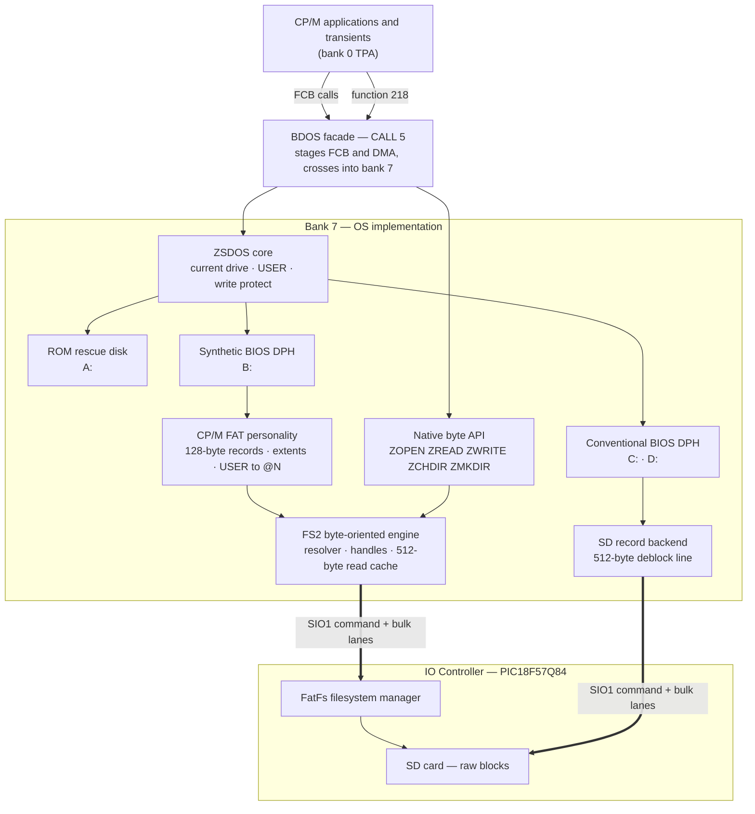

# Zephyr / ZSDOS Alteration Guide

> **Audience:** Developers who want to modify the Zephyr-80 operating system,
> add storage personalities, extend BDOS/native services, alter BIOS behavior,
> or change the IOC protocol without accidentally breaking CP/M/ZSDOS
> compatibility.
>
> **Source of truth:** The current repository, generated memory map, and
> hardware behavior are authoritative for implementation details. This guide
> records the architectural contracts and procedures that should survive code
> movement and refactoring.
>
> For the history behind these rules, including the bugs and experiments that
> exposed them, see
> [FAT-BRINGUP-LESSONS-LEARNED.md](FAT-BRINGUP-LESSONS-LEARNED.md).

---

# Part 0 — The Exploded View

This part names the parts. It describes how the system is built; it does not say
what you may do to it. Every rule in this document lives in Part I, and every
procedure in Part II. If a sentence here sounds like an instruction, it is
describing a mechanism, not imposing a constraint.

Read it once before the rest. The procedures in Part II assume you know what the
facade is, what bank 7 is for, and why there are two ways to reach the same
file; without that they read as arbitrary ceremony.

---

## 0.1 The machine

A Z80 with a 64 KiB address space, more memory than fits in it, and a
microcontroller that owns the hardware the Z80 cannot reach.

Eight 64 KiB SRAM banks sit behind a banking latch. Bank 0 is the ordinary
application bank and backs common memory; banks 1-6 are application banks; bank
7 is the operating system and is never application memory — the bank primitives
reject any attempt to select it.

The latch carries a bank number and a two-bit memory mode:

| Mode | Name | `0000h-1FFFh` | `2000h-DFFFh` | `E000h-FFFFh` |
|---|---|---|---|---|
| `00` | ROM | ROM page | ROM page | ROM page |
| `01` | flat | bank N | bank N | bank N |
| `10` | application | bank N | bank N | bank 0 |
| `11` | OS | bank N | **bank 7** | bank 0 |

Modes 10 and 11 differ by one bit, and only in the middle. That single
difference is the whole banked design, and it produces **three address classes**
that the rest of this document refers to constantly:

**The caller window, `0000h-1FFFh`.** The running program's bank in *both*
modes. It holds CP/M's page zero — the warm-boot vector at `0000h`, the BDOS
vector at `0005h`, the default FCBs, the default DMA at `0080h`. Because it does
not move, ZSDOS reads the program's real page zero while the OS is running, with
no copies to keep synchronised, and the common case of a default FCB and DMA
needs no marshalling at all.

**The switchable body, `2000h-DFFFh`.** The application's bank in mode 10; bank 7
in mode 11. This is the OS's private implementation space. A program's memory
here *disappears* while the OS runs, which is why anything the OS must read from
or write to the caller has to be staged.

**Common memory, `E000h-FFFFh`.** Bank 0 in both modes, the same bytes always
visible. This is where crossing code, interrupt handlers, staging buffers and
the published entry points live — and it is only 8 KiB, every byte of which is
subtracted from every program's address space.

The latch keeps the application's bank number while the OS runs, so entering and
leaving the OS is a single bit change and nothing has to remember which bank was
suspended.

Alongside the Z80 sits the **IO Controller**, a PIC microcontroller reached over
a synchronous serial link with a command lane and a bulk lane. It owns the SD
card, the USB keyboard, and — importantly — the FAT filesystem. No FAT
implementation runs on the Z80.

### The exploded diagram

Where the software actually sits. Addresses are from the current default build;
`docs/memory-map.md` is regenerated every build and is the authority.

```text
          MODE 10 — what a program sees          MODE 11 — what the OS sees

 FFFFh  +=====================================================================+
        |  COMMON MEMORY — bank 0, identical in both modes, 8 KiB total       |
        |                                                                     |
        |    EC00h  BDOS facade: CALL 5, FBASE, staging, functions 200-218    |
        |    F000h  BIOS tables, boot, banking helpers, SIO core              |
        |    F538h  crossing gates  ·  F730h interrupt dispatch               |
        |    F958h  staging buffers ·  FD00h IM2 vector page                  |
        |    FE01h  BIOS state      ·  FE80h ISR / gate / facade stacks       |
        +=====================================================================+
 EC00h  |  E400h-EBFFh  CCP (ZCPR2) — a user program, inside the TPA:         |
        |               a transient may overwrite it, and warm boot           |
        |               restores it from the bank-7 asset                     |
 E400h  +---------------------------------------------------------------------+
        |  E000h-E3FFh  the running program's interrupt callbacks             |
 E000h  +-------------------------------+-------------------------------------+
        |                               |  BANK 7 — the OS body               |
        |                               |                                     |
        |                               |    C000h  BIOS stacks, SD scratch,  |
        |                               |           pristine CCP, FAT state   |
        |   TRANSIENT PROGRAM AREA      |    9000h  FAT BDOS personality,     |
        |   0100h-EC05h, 58.8 KiB       |           FS2 client, read cache    |
        |   continues up through E000h  |    8000h  font, boot banner         |
        |   in the program's own bank   |    6000h  DPH/DPB, dir buffer,      |
        |   (N = 0..6)                  |           reclaimable cache pool    |
        |                               |    4800h  console driver (slot 0)   |
        |                               |    3000h  BIOS facades, drivers,    |
        |                               |           IOC command + bulk lanes  |
        |                               |    2000h  ZSDOS                     |
 2000h  +===============================+=====================================+
        |  CALLER WINDOW — the program's bank in BOTH modes                   |
        |    0100h-1FFFh  the bottom of the TPA                               |
        |    0000h JP WBOOT · 0005h JP FBASE · 005Ch FCBs · 0080h default DMA |
 0000h  +=====================================================================+

                                  |  synchronous serial: command + bulk lanes
                                  v
        +---------------------------------------------------------------------+
        |  IO CONTROLLER (PIC18F57Q84)                                        |
        |    FatFs filesystem manager · FS2 service · SD card · USB keyboard  |
        +---------------------------------------------------------------------+
```

Three things in that picture explain most of the design:

- The OS body and the program's memory occupy **the same addresses**. They cannot
  both be visible.
- Common memory is **small and shared**, so what goes there is rationed.
- The filesystem is **on the other side of a serial link**, so file operations
  are transactions with latency, not memory accesses.

And one thing the picture can mislead about: common memory is 8 KiB, but the OS
does not own all of it. `E000h-EBFFh` — the interrupt-callback reservation and
the CCP — belongs to the running program. Page zero's `0006h` holds `EC06h`, so
the transient program area really does run to `EC05h`, and the CCP is a user
program sitting inside it, not a layer above it. The OS's share of common memory
starts at the BDOS facade.

---

## 0.2 The software pieces

| Piece | Where it runs | What it is |
|---|---|---|
| **ZCPR2** | `E400h-EBFFh`, inside the TPA | the command processor. Not an OS component: a user program at a fixed high address, which a transient may overwrite and which warm boot restores from a pristine copy held in bank 7 |
| **ZSDOS** | bank 7, `2000h` | the BDOS. A ZSDOS build, not stock CP/M. Authoritative for current drive, USER, and write protection |
| **BDOS facade** | common, `EC00h` | the only application-to-OS crossing. Publishes `FBASE`, stages caller objects, enters mode 11, restores the caller's mapping on the way out |
| **bank-7 dispatcher** | bank 7 | decides, per call, whether Zephyr semantics apply or the call goes to ZSDOS unchanged |
| **BIOS** | split | CP/M jump table and crossing gates in common memory; console, storage and transport bodies in bank 7 |
| **drivers** | bank 7 slots | console and storage backends behind facades, selected at build time |
| **CP/M FAT personality** | bank 7, `9000h` | translates FCBs, 128-byte records, extents, USER areas and SEARCH into byte-oriented file operations |
| **native API** | bank 7 | `ZOPEN`/`ZREAD`/`ZWRITE`/`ZCHDIR`/`ZMKDIR`, reached through BDOS function 218. Paths and bytes, no FCBs |
| **FS2 client** | bank 7 | the byte-oriented engine both personalities converge on: resolver, handles, 512-byte read cache |
| **IOC transport** | bank 7 + common | `IOCALL` (32-byte mailbox), `IOCBULK`/`IOCBULKW` (block transfer) over the command and bulk lanes |
| **FatFs** | IO Controller | the actual filesystem, on the MCU, over the SD card |
| **resource layer** | above the native API | caching, prefetch, streaming and symbolic asset lookup. Not a filesystem |

How they connect:



Reading it:

- **ZSDOS stays on the CP/M path and owns CP/M state.** The FAT drive reaches it
  as an ordinary BIOS drive through a synthetic DPH, which is what lets drive
  selection, USER and write protection keep working normally.
- **The two personalities converge at FS2, not above it.** The CP/M personality
  translates FCBs, records, USER areas and SEARCH semantics. The native API does
  not.
- **The facade is the only application/bank-7 crossing.** Caller pointers and
  buffers are staged there, which is why its aliasing and status-preservation
  behavior is part of the ABI.
- **The controller owns FAT.** No FAT implementation runs on the Z80.

Authority for each piece of CP/M state — who is allowed to be the one true copy
of the current drive, USER, write protection and the rest — is a rule rather
than a description, and the table lives in Part I, §2.

---

## 0.3 The two personalities

This is the single most important concept in the document.

The same files on the same card are reachable two ways, and the two ways mean
different things:

```text
                         FatFs / media
                              |
                     +--------+--------+
                     |                 |
              CP/M compatibility   native Zephyr
                     |                 |
                 FCB / USER         paths / bytes
                 128-byte records   larger transfers
                 synthetic extents  directories
```

**The CP/M personality exists for unmodified software.** PIP, STAT, CRC, an
assembler written in 1981 — none of them know anything about FAT, and none of
them should have to. So the FAT drive is presented as an ordinary CP/M drive:
FCBs, 128-byte records, extents, USER numbers, SEARCH FIRST/NEXT. Everything
CP/M software expects is synthesized on top of a filesystem that has none of it
natively.

**The native personality exists so that new software need not inherit CP/M's
limits.** A 128-byte record and a 36-byte FCB are not a good interface to a file
in 2026. The native API takes paths, transfers arbitrary byte counts, and knows
about directories.

A native call still arrives through `CALL 5`. That does **not** make it a CP/M
filesystem operation — BDOS function 218 is a syscall gateway to native
semantics, not a CP/M function.

They converge at FS2, deliberately low. Everything CP/M-shaped — extent
arithmetic, `e5h` directory slots, the USER-to-`@N` projection, SEARCH
continuation state — lives in the CP/M personality above FS2 and nowhere else.
Collapsing the two views into one would mean either giving native software
CP/M's limits or giving CP/M software semantics it cannot survive.

The CP/M personality reaches ZSDOS as a **synthetic BIOS drive**. It supplies a
DPH, a DPB and an allocation vector that describe a plausible empty disk, so
ZSDOS can select and log the drive by its ordinary machinery. Real file access
happens above that layer. The synthetic disk is also a safety net: an operation
that accidentally falls through to ordinary ZSDOS disk processing sees an empty
disk rather than whatever conventional drive was selected before.

---

## 0.4 The boundaries

Knowing which crossings are contractual is what keeps you from breaking one by
accident.

| Boundary | Kind | Notes |
|---|---|---|
| `CALL 5` / `FBASE` | **ABI** | the published program interface, including the Zephyr function range |
| BDOS function 218 descriptor | **ABI** | versioned; the native syscall gateway |
| page zero conventions | **ABI** | `0000h`, `0005h`, default FCBs, `0080h` DMA |
| CP/M BIOS jump table | **ABI** | order and entry semantics are fixed; new calls append |
| BDOS functions 27 / 31 returns | **ABI** | caller-visible copies, which is why they are copies |
| IOC command and bulk protocol | **ABI across processors** | Z80 and MCU are flashed separately; both sides must agree, and capability level is part of the contract |
| facade → bank-7 dispatcher | internal | staging and crossing mechanism, may change together |
| dispatcher → ZSDOS | internal | but ZSDOS's own state authority is not internal |
| CP/M personality → FS2 | internal | the convergence point |
| native API → FS2 | internal | |
| FS2 → IOC transport | internal | |
| console facade → driver table | internal | seven-entry table; stable by convention, not published to programs |
| storage facade → backend | internal | neutral `stg_a_*` entry points |
| SIO0/B, SIO1 lanes | **hardware** | flow control, clocking and interrupt behavior are electrical facts |
| banking latch | **hardware** | the decoder revision is part of the contract |

The asymmetry worth internalizing: **anything a program or another processor can
observe is contractual, and almost nothing else is.** The layering inside bank 7
is yours to rearrange; the moment a value, pointer or packet crosses into an
application or onto the wire, it is not.

---

## 0.5 The drive and namespace model

Four drive letters, three kinds of backend:

| Drive | Backend | Notes |
|---|---|---|
| `A:` | ROM rescue disk | read-only volume in flash; the recovery path, built from a manifest |
| `B:` | FAT personality | synthetic DPH over FS2 and FatFs on the controller |
| `C:`, `D:` | conventional CP/M volumes | real record-oriented CP/M filesystems on SD units |

`C:` and `D:` matter beyond their own contents: they are the **oracle**. When a
FAT behavior is in question, the same operation on a conventional drive shows
what CP/M actually does.

The FAT namespace projects CP/M's USER numbers onto directories:

```text
USER 0: /CPM/D/<relative-CWD>/<name>
USER N: /CPM/D/@N/<relative-CWD>/<name>
```

Three separate things are easy to conflate here:

- **The drive letter** (`B:`) is the CP/M-visible drive number. It is
  configuration, not ABI, but it appears in more places than one constant —
  layout definitions, dispatch arithmetic, utilities with compiled-in
  assumptions, tests, and help text. Changing it is a coupled release.
- **The on-card root** (`/CPM/D`) is a filesystem convention. The `D` is
  historical and no longer matches the drive letter. That is legal, because the
  root component is not the ABI drive number — but a future remap should state
  deliberately whether the directory is renamed too.
- **The USER projection** (`@N`) is a directory layer inside the root, owned by
  the FAT personality. A relative current directory belongs to the USER that
  selected it, and drive *availability* is a property of the root — not of
  whatever subdirectory happens to be current.

---

## 0.6 Where changes usually land

The reader's index. Find the shape of your change, then read the procedure.

| I want to… | The relevant piece | Procedure |
|---|---|---|
| build an image, or change a build option | the Makefile and its validators | §9 |
| change or intercept a BDOS function | facade + bank-7 dispatcher | §11 |
| add a new native (non-CP/M) operation | native API + function 218 gate | §12 |
| add or change an IOC command | FS2 / IOC protocol, both processors | §13 |
| add a new kind of drive | storage personality + synthetic DPH | §14 |
| write a driver for new hardware | driver slots, facades, driver tables | §15 |
| make something writable that was not | personality + FS2 + mutation invalidation | §16 |
| add a cache, handle or lease | resource pool + invalidation matrix | §17, Appendix C |
| change USER, CWD or the drive map | personality namespace + every coupled consumer | §18 |
| write or fix a `.COM` utility | CP/M/ZCPR transient conventions | §19 |
| make something faster | measure first, then transaction count | §20 |
| write a test for any of the above | the qkz80 harness | §21 |
| find out what CP/M really does | characterization tools, conventional-drive oracle | §22, §27 |
| know what to run before committing | the regression checklist | §31 |

If your change does not fit a row, that is worth noticing before you start: it
usually means either the change spans layers that were deliberately separated,
or it belongs somewhere other than where you first looked.

---

## 0.7 What to read next

- **Part I** is the constitution: what must remain true regardless of how the
  code is arranged. Read it once in full. It is short, and every rule in it was
  paid for.
- **Part II** is the procedures, organized as "I want to change X." Read the one
  section you need, plus §9 if you have not built the system before.
- **Part III** is verification: how to prove both that your change works and
  that you did not quietly redefine CP/M. Read §21 before writing a test and
  §31 before committing.
- **Appendix A** gives the current file names, symbols and addresses for
  everything described above. This part is stable across refactors; Appendix A
  is not, and the generated `docs/memory-map.md` supersedes both for any
  address.
- **`FAT-BRINGUP-LESSONS-LEARNED.md`** is the history: the bugs and experiments
  that produced these rules. Nothing in this document depends on it, but it
  explains why several of the rules are stricter than they look.

---

# Part I — The Architectural Constitution

These are invariants. A contribution may extend them deliberately, but should
not violate them accidentally.

## 1. Extend ZSDOS around its interfaces

Zephyr should extend ZSDOS **around its interfaces**, not gradually turn into a
private fork of ZSDOS.

The preferred layering is:

```text
application
    |
    v
CALL 5 / common facade
    |
    v
bank-7 dispatcher
    |
    +-- Zephyr-specific semantics
    |
    +-- ZSDOS_ENTRY
            |
            v
           BIOS
```

If a change can be implemented at the facade/dispatcher or BIOS boundary,
prefer that to modifying ZSDOS internals.

The FAT-backed drive is the reference example: Zephyr added a fundamentally
different filesystem while leaving ZSDOS authoritative for normal CP/M state.

If an actual ZSDOS source modification becomes necessary, document before
making it:

- what cannot be achieved at the facade, dispatcher, or BIOS boundary;
- why it cannot be achieved there;
- the minimum ZSDOS change required;
- the compatibility consequences.

---

## 2. State has one authority

Do not create a second authoritative copy of CP/M state.

| State | Authority | Zephyr may do |
|---|---|---|
| Current drive | ZSDOS | mirror/cache it |
| USER | ZSDOS function 32 | mirror it |
| Software write protect | ZSDOS | mirror it for intercepted mutations |
| DMA semantics | CP/M/ZSDOS facade contract | stage/copy as required |
| DPH/DPB/ALV | BIOS/ZSDOS-visible model | synthesize where a backend requires |
| FAT relative current directory | Zephyr FAT backend | own it and tag it with its USER |
| IOC/FS2 handles | Zephyr implementation | cache opportunistically |
| Media/context generation | FS2/IOC | mirror and invalidate local state |
| Application bank identity | Zephyr memory model | preserve across crossings/interrupts |

A mirror must be disposable and reconstructible.

If losing a value would break correctness, it should not exist only as a
mirror.

### Current ZSDOS write-protect wrinkle

The present ZSDOS build is configured with the hard read-only behavior enabled
in its flags. Once a drive is software write-protected, the normal reset-disk
paths may deliberately leave that protection asserted until the relevant ZSDOS
flag is changed or the system is cold-booted.

Therefore:

- query ZSDOS directly before blaming a stale FAT-side mirror;
- diagnostics that set software write protection must restore the prior ZSDOS
  state deliberately;
- FAT/native code must never reinterpret software write protection as a FAT
  file attribute.

---

## 3. Bank 7 is implementation space; common memory is ABI space

> **Bank 7 is the normal implementation space for the OS. Common bank-0 memory
> exists for crossing and ABI requirements.**

New OS logic, tables, and persistent implementation state belong in bank 7 by
default.

Common memory is justified only for objects that genuinely must remain visible
while application mapping is active, such as:

- CALL 5 / BDOS facade entry;
- bank-transition helpers;
- interrupt-entry infrastructure;
- caller-visible returned objects;
- staging buffers;
- cross-mode stack/state.

Free common memory is not by itself a reason to place implementation code
there.

The generated memory map and allocator ownership are authoritative. Historical
free ranges are not.

Reclaimable 512-byte arenas remain allocator-owned and must not silently become
permanent module storage.

### The facade is an ABI boundary, not a trampoline

Before adding a crossing, answer:

```text
What must remain visible in the caller mapping?
What can remain entirely in bank 7?
Does the caller expect a pointer back?
Can that returned pointer legally refer to bank-7 storage?
Can source and destination aliases occur on real hardware?
```

Normally, application-visible pointers may not refer directly to private
bank-7 objects.

Reuse the existing staging/crossing machinery. Do not invent a new crossing
framework for each subsystem.

### Aliasing is part of the machine model

The test harness must model real address aliasing, not merely function
interfaces.

A concrete current example is:

```text
FAC_DMA_BUF = FAC_BULK_BUF
```

When bank 7 is selected, an application DMA buffer in the TPA disappears and
the facade stages it into common memory. Code that subsequently treats the DMA
staging area and the bulk buffer as independent buffers is wrong on hardware
even if a unit test with two scratch addresses passes.

Any change that introduces a second use of an existing common buffer must be
reviewed for aliasing.

`SELDSK` must validate the drive root, not a USER-relative current directory.
For the current FAT B: personality, availability means that `/CPM/D` can be resolved
and a synthetic DPH can be returned. Replaying `/CPM/D/@N/<cwd>` during
`SELDSK` can make the whole drive disappear merely because a USER-specific
subdirectory was removed or because the probe omitted the USER component.
Path resolution belongs to the intercepted file/native operation after login.

---

## 4. Preserve personalities instead of collapsing them

Zephyr deliberately presents more than one view of the same storage. §0.3
describes the two personalities and where they converge; this section is the
constraint that keeps them apart.

Do not migrate CP/M-shaped semantics below the convergence point, and do not
give the native API CP/M's limits in order to share code with the compatibility
path. Extent arithmetic, directory-slot encoding, the USER-to-`@N` projection
and SEARCH continuation state belong in the CP/M personality and nowhere else.

A native call may still enter through CALL 5. That does **not** make it a CP/M
filesystem operation. Function 218 is a syscall gateway to native Zephyr
semantics.

Resource services belong above the native filesystem API:

```text
RESOURCE_OPEN / READ / SEEK
        |
        v
ZOPEN / ZREAD / ZSEEK
        |
        v
FS2
        |
        v
FatFs
```

The resource layer may add caching, prefetching, decompression, streaming,
symbolic asset lookup, and eviction. It should not become another filesystem.

---

## 5. Synthetic BIOS personalities participate in ZSDOS state

A backend does not need to be a real CP/M block filesystem to participate in
the CP/M disk model.

The FAT-backed personality uses synthetic BIOS behavior so ZSDOS can select and
log the drive normally:

```text
SELDSK  -> validate drive root and return synthetic DPH
READ    -> harmless synthetic empty-disk view
WRITE   -> failure when a real BIOS write is inappropriate
DPB     -> synthetic geometry
ALV     -> synthetic capacity view
```

Real FAT file access happens above this BIOS layer.

This gives two important properties:

1. ZSDOS remains authoritative for current-drive/login bookkeeping.
2. If a FAT-dependent operation accidentally falls through to ordinary ZSDOS
   disk processing, it sees an empty synthetic disk rather than the previously
   selected conventional drive.

### SELDSK tests drive availability, not the current directory

For a FAT personality, SELDSK should validate the configured drive root (for
example `/CPM/D`) and return the synthetic DPH.

It must **not** make drive availability depend on the currently selected USER
subdirectory or relative CWD. A renamed or missing subdirectory is a path
problem, not evidence that the logical drive disappeared.

---

## 6. CP/M-visible state remains reconstructible

### FCBs are authoritative

Applications may copy FCBs.

Therefore an FCB must remain sufficient to reconstruct a CP/M file operation.

Do not hide an IOC/FS2 token inside an FCB or make correctness depend on a
specific controller handle surviving.

IOC handles may be cached by identity, for example:

```text
drive
USER
current-directory generation
packed 8.3 filename
```

but the handle is opportunistic.

If it disappears, becomes stale, or is retired by a namespace mutation, reopen
from authoritative FCB/path state.

Writable operations must acquire appropriate writable state separately. Never
silently reuse a stale or read-only cached token for mutation.

### Explicit-drive operations may temporarily reselect drives

A ZSDOS operation on an explicit C: FCB while B: is current may internally
behave like:

```text
remember B
select C
perform operation
restore B
return
```

An error reported during BDOS READ on C: therefore does not prove the C: read
itself failed. The later restoration of B: may have failed.

When debugging this class of problem, trace actual SELDSK transitions.

### USER and hierarchy are separate layers

The accepted FAT compatibility projection is:

```text
USER 0: /CPM/D/<relative-CWD>/<name>
USER N: /CPM/D/@N/<relative-CWD>/<name>
```

The USER namespace precedes the saved relative CWD.

The current build supports USER 0 through 15. Do not assume 0 through 31 merely
because another CP/M-family system does.

A relative CWD selected under one USER must not silently become the relative CWD
of another USER.

Native path access is not required to apply the CP/M USER projection.

---

## 7. SEARCH is an observable ABI

Do not reduce SEARCH FIRST/NEXT to "find matching filenames."

Legacy software may observe:

- A = 0..3 selecting a 32-byte DMA slot;
- the selected entry at `DMA + A * 32`;
- USER;
- packed 8.3 name;
- EX/S1/S2/RC;
- attribute high bits where applicable;
- caller-FCB mutation/preservation behavior;
- continuation across SEARCH NEXT;
- end-of-search return behavior.

The FAT personality is allowed to choose a simpler valid representation. The
hardware-accepted implementation currently uses:

```text
DMA[0..127] = E5h
DMA[0..31]  = one synthetic directory entry
A           = 00h
```

and on exhaustion:

```text
A           = FFh
DMA         = unspecified
```

It emits one synthetic entry per FAT file. For a large file the entry carries
the terminal EX/S2/RC representation; function 35 remains the authority for the
complete rounded-up record count. Allocation bytes are synthetic/zero because
there is no physical CP/M allocation layout to expose.

This is intentional restraint: reproduce observable compatibility, not a
fictional CP/M allocator.

### `FCB[0] = '?'` is a real SEARCH mode

For SEARCH, `FCB[0] = 3Fh ('?')` is not an invalid drive number.

On this ZSDOS build it means a raw current-drive search across supported USER
areas.

The FAT dispatcher must preserve that mode across SEARCH NEXT, skip missing
`@N` directories, and return the source USER in each synthetic entry.

This behavior is required by real software such as CRC.

### FAT metadata is not CP/M metadata

Do not project FAT HIDDEN/SYSTEM/ARCHIVE bits into synthetic CP/M directory
attributes.

The semantic models are different and real CP/M software noticed the mismatch.

ZSDOS software write protection remains a separate authority.

---

## 8. Interrupt, transport, and mutation safety are OS contracts

### BIOS/core owns interrupt architecture

Programs register callbacks through Zephyr mechanisms rather than taking
ownership of the I register or rewriting the IM2 vector table.

Drivers may own device-specific handling policy. They do not automatically own
the global interrupt architecture.

### The receive critical section begins at the first RX-ready

The IOC is clock master. Once the first reply byte arrives, the rest of the
reply continues whether the Z80 is ready or not.

The required shape is:

```text
wait for first RX-ready     interrupts enabled
first RX-ready observed
DI
marker recognition
reply body
bulk phase
EI
```

Masking only after marker recognition is too late: a timer interrupt can allow
the SIO FIFO to overflow before the supposedly protected region begins.

A transport failure can surface as a high-level filesystem or ZSDOS error. The
layer reporting the failure is not necessarily the layer that caused it.

### Reads and writes have different recovery rules

Reads are generally safe to reopen/reconstruct and retry once.

Writes may be:

```text
definitely not committed
definitely committed
completion unknown
```

Unknown completion must not be converted into "retry."

For bulk writes:

```text
WRITE reply / READY
    -> IOC has armed receive

IOCBULKW completes
    -> bytes crossed the link

XFER_STATUS / DONE with matching transfer ID
    -> final commit status is known
```

READY and a successful bulk transfer are not proof of commit.

If DONE is lost, malformed, or refers to another transfer, return an
unknown-write outcome and invalidate the writable context.

Writable stale handles do not use the read-side reopen-and-retry policy.

---

# Part II — Subsystem Implementation Protocols

This part is organized by contributor task: "I want to change X; what is the
safe procedure?"

## 9. How to build the OS

Everything in this guide assumes you can produce an image and read what the
build says about it. The build is also the first verification step: most layout
and ABI mistakes are caught by the build itself, not by running the machine.

### Where the build lives

```text
Code/HOST/CPM2.2/          the operating system: BIOS, ZCPR2, ZSDOS, tools
  src/
    zephyr.asm             the assembly root: include order and nothing else
    layout/                the address authority: memory.inc, platform.inc, modes.inc
    common/                code that must be mapped under more than one latch state
    core/                  bank 7; defines the contracts
    drivers/               bank 7; implements them -- console/ storage/ transport/
    assets/                font and other read-only data
  zcpr2/ zsdos/            command processor and BDOS sources
  tools/                   image builder, validators, doc generator, harness runners
  tests/                   libqkz80 harnesses
  config/                  payload map and the cpmtools disk definition
  build/                   every generated artifact
  docs/                    generated and hand-written documentation
```

A file's directory states which memory class it belongs to, and the build checks
that claim against the addresses the file actually emits. `common/` must land in
`E000h-FFFFh`; `core/`, `drivers/` and `assets/` must land in bank 7.

All commands below run from `Code/HOST/CPM2.2`.

### Prerequisites

| Needed for | Tool |
|---|---|
| the image | GNU Make, Python 3, SDCC's `sdasz80`, `sdldz80`, `makebin` |
| ZCPR2 and ZSDOS | a host C compiler; the CP/M emulator is vendored in `tools/runcpm` and compiled on first use |
| drive A: contents | the sibling `Utilities` and `Monitor` projects, built automatically |
| `make test` | a C++17 compiler and libqkz80 headers/library |

Nothing is resolved from a checkout elsewhere on your disk. The period
assemblers that build ZCPR2 and ZSDOS run under the vendored RunCPM, which is
patched to select `CCP_ZCPR3`; an unmodified upstream RunCPM has never worked
for this build, so do not point `RUNCPM=` at one.

### The ordinary build

```sh
make
```

That produces the default machine: physical V9958 console, ROM drive A:, SD
drive B: with the FAT personality enabled. It ends by printing the
configuration it just built, and the name of the image to flash:

```text
  ROM built:  CCP=zcpr2  BDOS=zsdos
    FAT drive: enabled
    build/zephyr80.bin
    build/zephyr80-zcpr2-zsdos.bin   <- flash this one to be sure
```

The stamped copy exists because `build/zephyr80.bin` is the same filename for
every configuration. Verifying one configuration and then flashing "the ROM"
has already shipped the wrong image once. Flash the stamped name.

### Build-time configuration

| Variable | Values | Meaning |
|---|---|---|
| `CONSOLE` | `v9958` (default), `vdrip` | which console backend is linked into the console slot |
| `STORAGE_A` | `rom` (default), `vdrip` | which drive A: backend is linked |
| `FAT_BIOS_M1` | `1` (default), `0` | `0` parks the synthetic FAT drive without moving anything; a recovery build |
| `CCP` / `BDOS` | `zcpr2` / `zsdos` | fixed. The stock CP/M CCP and BDOS cannot run behind the banked OS, and the Makefile refuses any other pair. |

Two combinations are constrained rather than free:

- `STORAGE_A=vdrip` requires `CONSOLE=vdrip`, because both ride the shared
  VDrip transport.
- `CONSOLE=vdrip` currently does not build at all. The transport is 654 bytes
  and the common-memory hole it used to occupy now holds the crossing gates,
  the interrupt dispatcher and the serial console tee. This is arithmetic, not
  a regression to hunt; `docs/vdrip-backend-restoration.md` has the
  measurements.

A `FAT_BIOS_M1=0` build is marked in the filename (`-nofat`). The other
configurations are not, which is another reason to read the printed summary.

### What the build actually does

```text
Makefile -> build/config.inc     the feature flags, as an assembler header every
                                 translation unit includes

src/zephyr.asm -> firmware.rel   one assembly: layout, common, core, and the
                                 common half of each split driver
src/drivers/**  -> drv_*.rel     each driver is its own translation unit; the
                                 build selects which objects to link, so a
                                 CONSOLE or STORAGE_A choice is a link input
  -> sdldz80 -> firmware.ihx     absolute .org layout, no relocation
                -u               rewrites each .lst as a .rst with resolved
                                 addresses; those are the symbol authority
       check_overlap.py          FAILS on any byte emitted twice
       check_diag_record.py      FAILS if the IOC failure record drifts from
                                 the copy the CP/M tools assemble against
       check_org_placement.py    FAILS if an .org did not land on its constant
  -> makebin -> firmware_flat.bin
  -> split_banked_image.py       cuts the flat space into ROM page 0 (common
                                 memory, reset vector) and the bank 7 payload,
                                 installing ZCPR2 at CBASE and ZSDOS at its org
  -> build_zephyr_image.py       assembles the 512 KiB burnable ROM from page 0,
                                 bank 7 and the ROM-disk chunks; writes
                                 build/layout.manifest and layout-report.md
  -> generate_memory_docs.py     validates every declared region against its
                                 limit and writes docs/memory-map.md and
                                 docs/symbol-map.md
```

Two dependencies are worth knowing because they look like nothing:

- ZSDOS is assembled against `build/firmware.map`. It jumps to `WBTRAP`, the
  common warm-boot trap, by absolute address, and that address moves whenever
  the BIOS is rebuilt. The address is generated, never written down; a stale
  one would assemble cleanly and jump into the middle of something at run time.
- ZCPR2 is assembled against `CBASE` and `CBIOS_BASE` read directly out of the
  firmware sources, so the command processor cannot drift from the layout.

### The ROM disk

`make` rebuilds the sibling `Utilities` and `Monitor` projects every time and
takes their binaries for drive A:. That is deliberate: their outputs used to be
picked up as found, so a clean build here could still ship tools compiled
against a different BIOS, and after one branch switch every IOC tool on A:
failed with a transport error.

Shipping a new transient on A: means adding a `MANIFEST` row in
`tools/build_rom_disk.py`, not copying a file anywhere. Staging happens under
`build/`; nothing in the tracked tree is rewritten.

`images/*.cpm` are user-owned volumes. The build never writes them, and neither
should you.

### Reading the result

Primary artifacts:

| Artifact | Meaning |
|---|---|
| `build/zephyr80-<ccp>-<bdos>.bin` | the 512 KiB image to flash |
| `build/firmware.bin` | ROM page 0: reset vector and common memory |
| `build/bank7.bin` | bank 7 payload: ZSDOS, the BIOS and drivers |
| `build/firmware.rst`, `build/drv_*.rst` | linker-resolved listings; the symbol authority for the doc generator and the harnesses |
| `build/layout-report.md` | region placement as the image builder saw it |
| `docs/memory-map.md` | generated map, per-region free space, validation report |
| `docs/symbol-map.md` | generated jump tables, IM2 page and symbols |

`docs/memory-map.md` and `docs/symbol-map.md` are generated on every build and
are the address authority afterwards. Prose size comments in sources drift;
these do not. Never hand-edit them.

After a layout-affecting change, read the generated map and confirm:

- every region still ends at or below its limit, and the free-space column is
  what you expected;
- the CP/M BIOS jump table is intact and in order;
- the region you grew did not silently consume the slack another region was
  relying on.

### What the build refuses to do

The build stops rather than producing a subtly wrong image when:

- two sections emit bytes at the same address (`check_overlap.py` names the
  nearest symbol on each side);
- a declared region runs past its limit;
- the IOC failure record definition and the CP/M tools' mirror of it disagree;
- an unsupported `CONSOLE`, `STORAGE_A`, `FAT_BIOS_M1`, or `CCP`/`BDOS`
  combination is requested;
- a sibling binary the ROM disk manifest names has not been built.

Do not work around these by moving something else out of the way until you have
read the section on driver slots below.

### Cleaning

```sh
make clean
```

removes `build/` here and cleans the sibling projects too.

### Pairing

The ROM must be paired with memory decoder revision 11 from
`Code/HDL/WinCUPL`. An image built here and flashed onto a machine with an
older decoder will not boot, and the failure looks like a BIOS fault.

---

## 10. General alteration workflow

Before changing OS behavior:

1. **Identify the authority.**  
   Decide which component owns the state or semantic contract.

2. **Choose the lowest safe extension boundary.**  
   Prefer BIOS, facade, dispatcher, or native-service boundaries over ZSDOS
   internals.

3. **Classify memory placement.**  
   Default to bank 7. Justify any new common-memory object.

4. **Characterize observable legacy behavior.**  
   Especially for BDOS, FCB, SEARCH, drive selection, USER, and error behavior.

5. **Keep implementation state reconstructible.**  
   Cached handles and caches must not become hidden ABI.

6. **Make correctness independent of optimization.**

7. **Add focused tests before broad application tests.**

8. **Run conventional-drive regressions as well as the new personality.**

9. **Measure before altering transport or facade architecture.**

10. **Update this guide when the change establishes a new durable rule.**

---

## 11. How to add or intercept a BDOS call

Use the existing common facade and bank-7 dispatcher.

### Step 1 — decide whether interception is necessary

Intercept when the operation's semantics differ for a Zephyr personality.

Do not intercept ZSDOS bookkeeping merely because doing so is convenient.

Examples:

- FAT OPEN/READ/SEARCH: alternate semantics, intercept.
- current-drive selection: ZSDOS already owns it, preserve ZSDOS authority.
- USER: preserve function 32 authority and mirror only as needed.

### Step 2 — define staging requirements

Determine which arguments/pointers live in the application mapping and which
must be staged before entering bank 7.

Do not return bank-7 pointers to applications.

### Step 3 — preserve ZSDOS state transitions

If the operation needs normal ZSDOS pre/post behavior, call through or
post-process rather than emulating the state transition independently.

### Step 4 — preserve the semantic return value

Common crossing code is mechanical. If it uses A/flags/registers to decide
whether to copy data, save and restore the semantic result first.

A real bug in the native gate successfully completed CHDIR, then replaced the
returned status with the operation number while deciding whether a payload
copy was needed.

Test both:

- the returned register/status;
- any status copied into the request/response descriptor.

### Step 5 — verify complete crossing behavior

Do not test only the bank-7 worker. At least one test must exercise the
application -> common facade -> bank 7 -> common facade -> application path.

---

### FAT dispatch classification

For FCB calls, classify the function and FCB drive together:

```text
FCB[0] = 0       current drive
FCB[0] = 1..16   explicit A: through P:
FCB[0] = 3Fh     special raw SEARCH form, function 17 only
```

Ordinary FCB calls are intercepted only when their effective drive is the FAT
personality. Explicit conventional-drive calls must continue into ZSDOS even
while the FAT drive is current. SEARCH NEXT is routed from the saved SEARCH
context because it has no new drive byte to classify.

The current-drive and USER mirrors are maintained after successful ZSDOS calls;
do not query ZSDOS function 32 on every FAT operation merely to refresh a value
that already crossed the dispatcher.

When adding a FAT-side intercepted BDOS function, there are four coupled edits:

```text
1. common/facade.asm flags table
       F_FCB / F_SFCB / F_DMA_IN / F_DMA_OUT as required

2. fat_bdos_dispatch
       route the call
       carry set = handled, A is the BDOS result
       carry clear = continue into ZSDOS

3. fat_bdos_post
       maintain mirrors/invalidation when the call changes drive, USER,
       software write-protect state, or transient context

4. regression harness
       current FAT drive
       explicit FAT drive while another drive is current
       explicit conventional drive while FAT is current
```

The facade flags are easy to overlook: a write function without `F_DMA_IN`
does not receive the caller's record.

A function intentionally unsupported by the personality should fail explicitly
and document why rather than accidentally falling through or returning success.
Function 30 (set attributes) is the current example: FAT attribute projection
was deliberately removed.


## 12. How to add a native Zephyr operation

Function 218 is the current native-filesystem precedent.

### Required properties

- versioned request descriptor;
- byte-oriented semantics;
- caller pointers staged safely across banking;
- no IOC token exposed to applications;
- operation-specific state in bank 7;
- exact result preserved across the common gate.

### Pointer/count validation

Validate lengths before any `LDIR`.

On Z80:

```text
BC = 0
LDIR
```

copies 65536 bytes, not zero bytes.

Reject or skip zero-length transfers before `LDIR`, and reject lengths above
the supported staging size before changing memory mode.

Apply the same rule to lengths computed internally. A computed zero count is
just as dangerous as a caller-supplied zero.

### Flags are not durable state

Any `CP`, `OR`, `AND`, arithmetic operation, etc. changes condition flags.

Do not:

```text
call worker
cp SOME_SPECIAL_STATUS
...
jp nz,return_worker_result
```

and assume NZ still describes the worker's result.

Store/retest the semantic status explicitly.

### Spend the descriptor before growing the gate

The function-218 descriptor is fixed at 32 bytes and the common native gate is
already tightly budgeted. Prefer designs that reuse operation-specific fields
the operation does not otherwise need, or return large logical results one
element at a time.

Examples of useful patterns:

- a rename can reuse fields that have no meaning for rename to carry the second
  packed name;
- a multi-component result such as the current directory can take an index and
  return one component plus the total count per call.

Use the existing crossing helper rather than adding another common stub.

When an operation is answerable entirely from bank-7 state, state that fact in
its contract and test that it generates **zero controller traffic**. This keeps
future refactors from quietly turning a memory lookup into an IOC round trip.


### Native operations need native tests

Adding a native operation means adding a direct bank-7 harness case in the same
change.

FCB-path tests do not substitute for native API coverage even when both
personalities reach the same file.

---

## 13. How to extend FS2 or the IOC protocol

Protocol growth is additive.

### Checklist

When adding a command:

1. define the command/frame fields;
2. add dispatcher handling;
3. add external-sync/admission handling;
4. add capability advertisement;
5. move the IOC firmware level where required;
6. update host-side expected levels/capabilities;
7. add an end-to-end diagnostic;
8. test against firmware that lacks the capability.

Do not rely only on a firmware version when a capability bit can answer the
actual question.

A controller that silently does not admit a command can look like a hung
transport. Capability probing makes "unsupported" distinguishable from
"transport dead."

### Reuse the proven bulk lane

For new 512-byte-class transfers, prefer the existing bulk mechanism unless a
measured requirement proves it insufficient.

Writable FS2 reused the established receive-buffer + commit callback + DONE
lifecycle rather than inventing another transport.

### Firmware level and capability are both part of a protocol addition

For the current IOC tree, a command addition is not complete after editing only
the frame definition and dispatcher. Review all of:

```text
ioc_frame.h
dispatch.c
external_sync.c / command admission
IOC firmware level
host-side ioc_levels.inc mirror
FS2 capability bits
```

A controller that does not admit a command may drop the frame rather than
returning "unsupported", which looks like a transport hang. Capability
negotiation should therefore precede use of optional commands.


### Generation semantics

Generation covers media/context invalidation that can occur while the Z80 keeps
running.

An MCU reset resets the whole machine. Do not invent a recoverable MCU-session
nonce for host-side state that cannot survive such a reset in reality.

---

## 14. How to add or change a storage personality

A storage personality must separate three concerns:

```text
drive availability/login
filesystem/path resolution
actual data operations
```

### Step 1 — participate in SELDSK

Provide the synthetic DPH/DPB/ALV behavior required for ZSDOS to maintain
normal current-drive state.

### Step 2 — keep SELDSK narrow

SELDSK validates the logical drive/root, not a USER-specific CWD or a particular
file path.

### Step 3 — define the compatibility projection

Specify:

- drive root;
- USER mapping;
- relative-CWD mapping;
- FCB naming/filtering rules;
- SEARCH representation;
- synthetic free-space/geometry behavior.

### Step 4 — intercept only personality-specific file semantics

Preserve ZSDOS ownership of drive/USER/write-protect bookkeeping.

### Step 5 — keep destructive tools backend-oriented

A provisioning/destructive utility that addresses a physical backend directly
should name the backend, not a drive letter that can be reassigned in one
constant.

"Erase the SD backend" is stable. "Erase drive B:" may become dangerously
false after a drive-map change.

---

## 15. How to add a driver for new hardware

This section is written for the case of a builder who has made a new card — a
video card is the running example — and wants a BIOS driver for it.

### The slot idea, and what it is really worth

Driver code lives in fixed slots rather than being packed end to end. The slots
trade a little internal slack for a stable map: a driver can grow without
forcing every later driver to slide upward into a card castle, and the addresses
in a listing mean the same thing across builds.

The slack is the point. When your driver grows, the slack is what pays for it,
and when the slack runs out the build tells you which symbol you collided with.

### Where the slots actually are

The declarations are in the "Fixed Driver Slots" block of `src/layout/memory.inc`.
Read that block, not this list, before placing anything — but read this first,
because the declarations alone will mislead you:

| Slot | Declared base | Reality |
|---|---|---|
| 0 | `BIOS7_BASE + 1800h` = `4800h`, bank 7 | **live** — the console driver slot |
| 1-4 | `E400h`, `E800h`, `EC00h`, `F000h`, common | **vestigial** — those addresses now hold the CCP, the BDOS facade and the BIOS |
| 5 | `F680h`, common | **oversubscribed** — the interrupt dispatcher and serial console tee now occupy that run |

So the honest statement for a new card today is: **your driver goes in bank 7.**
Slots 1-5 are not free real estate waiting for you; their constants survive
because code still references them, not because the space is available. A patch
that places a new driver at `E800h` will fail `check_overlap.py`, and that
failure is correct.

The console slot has room. In the current default build the console region runs
`4800h-5FFFh` — 6144 bytes, of which the V9958 driver uses about 3.2 KiB and
nearly 3 KiB is free. `docs/memory-map.md` prints the live numbers after every
build; use those, not these.

### Bank 7 by default; common memory only if you must

Common memory is 8 KiB, and every byte you move there comes out of every
program's address space. Only three kinds of thing belong there:

- interrupt handlers and everything they touch;
- code that changes the memory mode, and the stacks it runs on;
- buffers that carry a program's data across the mapping.

A video driver is none of these. Its parser, renderer, font handling, cursor
state and port sequences all belong in bank 7. If you believe you need a byte in
common memory, say which of the three cases it is.

### Adding a console backend, step by step

The console facade in `src/core/console.asm` keeps the CP/M entry points stable
and dispatches through a driver table. Adding a backend means supplying that
table and being selectable at build time.

**1. Write `src/drivers/console/<name>.asm`.**

It is its own translation unit, so it carries its own headers, and its areas are
namespaced to it. That last point is not decorative: asxxxx concatenates
same-named areas across objects, so a second unit's `CODE` starts after the
first unit's and the `.org` that follows becomes relative instead of absolute.
`check_org_placement.py` catches it, but the convention avoids it:

```asm
	.module <name>_console

	.area CODE (ABS)
	.org CBIOS_DRIVER_SLOT0_BASE

<NAME>_CONSOLE_CODE_START:
	; ... table, entry points, state ...
<NAME>_CONSOLE_CODE_END:
```

**2. Publish the driver table.** Seven 16-bit little-endian entries, in this
order, at the head of the driver:

```text
+00 const   -> A = FFh if input is available, A = 00h otherwise
+02 conin   -> blocking input, character returned in A
+04 conout  -> blocking output of the character in C
+06 list    -> list/printer output of C, or a no-op
+08 punch   -> punch output of C, or a no-op
+0A reader  -> reader input, A = character or CP/M EOF
+0C listst  -> A = FFh if the list device is ready, A = 00h otherwise
```

The order is the contract. An unimplemented device is a `ret`, not a missing
entry.

**3. Provide the neutral backend aliases.** The rest of the BIOS calls the
selected backend by neutral name, so alias your own labels to them:

| Alias | Called by | Purpose |
|---|---|---|
| `console_backend_driver` | `console_init` | your driver table |
| `console_backend_cold_init` | cold boot | first-time hardware bring-up |
| `console_backend_init` | `console_init`, warm boot | re-init preserving owned state |
| `console_backend_send_frame` | `VIDEO_SEND` | one raw video request, payload ≤ 16 bytes |
| `console_backend_data_write_block` | `VIDEO_SEND` | the block-data video request |
| `console_backend_reset_display` | `VIDEO_SEND` with A = 00h or FFh | reinitialize the display |

Cold init and warm init usually differ only in whether they establish or
preserve driver-owned hardware shadow state. Warm boot reinitializes the console
after a transient has taken over the display, so warm init must be able to
rebuild the screen from driver state alone.

**4. Wire it into the build.** Four places, all of which the build will catch if
you miss them:

- `Makefile`: add the name to `VALID_CONSOLES`. Nothing rewrites your source --
  `DRIVER_REL_CONSOLE` resolves to `build/drv_console_$(CONSOLE).rel`, so the
  file must be `src/drivers/console/<name>.asm` and the build links your object
  instead of someone else's.
- `tools/generate_memory_docs.py`: add a `CONSOLE_REGIONS` entry naming your
  `_CODE_START` and `_CODE_END` symbols, the limit they must stay below, the
  `zone` (`driver`) and the `source` file. Without this your driver is
  unvalidated and undocumented, and the source check cannot vouch for it.
- `tools/build_zephyr_image.py`: add the name to the `--console` choices; it is
  recorded in the layout manifest and the report.
- `src/layout/memory.inc`: add a code base *and its own limit* if your driver
  needs a region of its own. Give it a ceiling rather than letting it end where
  the next region begins -- reserved slack is the whole point, and a region
  bounded by its neighbour loses it the moment the neighbour moves.

**5. Build, then read the map.**

```sh
make CONSOLE=<name>
```

Then open `docs/memory-map.md` and confirm your region appears, starts where you
declared, ends below its limit, and left the free space you expected.

### Rules your driver has to keep

These come from the console path contract, and violating them produces faults
that are expensive to find on hardware:

- **Input and output are separate concerns.** `CONST` reports availability,
  `CONIN` returns one byte, `CONOUT` emits one byte. A keyboard or packet
  handler must never draw characters, move the cursor or scroll the display. An
  echo test may do `CONIN -> CONOUT`; that is a harness behavior, not a shortcut
  inside the driver.
- **Do not expect `BC` to survive.** The facade preserves `DE` and `HL` around
  the indirect call but not `BC` — the packed facade region has no free bytes to
  save it. Callers must not hold a live value in `BC` across a console BIOS
  call, and your backend may clobber it.
- **You run on the console stack.** Dispatch switches to a private console stack
  in the BIOS stack reserve and restores the caller's stack on return. Do not
  assume the caller's stack depth, and do not switch stacks yourself.
- **Never call `CALL 5` from bank 7**, and never call BDOS from an interrupt
  handler. The facade is not reentrant.
- **Keep interrupt work small.** No large redraws from an ISR, no expensive
  parsing there, no waiting for transmit completion with interrupts disabled. A
  receive sink should enqueue the byte, update flow control, and return.
- **`E000h-E3FFh` belongs to the running program.** The operating system, your
  driver included, must not use it.
- **Document each public entry point** with its inputs, outputs, clobbered
  registers, whether it may block, and whether it is ISR-safe. The existing
  drivers do this and the headers are part of the design documentation.

### Known debt: the video contract speaks Virtual Drip

If you are writing a video driver, read this before you design its interface.

`VIDEO_SEND` — BDOS function 215 — is how a transient borrows the display from
the console driver. It dispatches to `console_backend_send_frame`,
`console_backend_data_write_block` and `console_backend_reset_display`, so it is
the seam every display backend sits on. Its vocabulary, however, is a serial
transport's:

- `A` is a **Virtual Drip packet type**, and callers hardcode the protocol's
  codes (`01h` VDP_CTRL_WRITE, `0Bh` VDP_DATA_BLOCK, `13h` PALETTE_WRITE);
- every type except `0Bh` is capped at `VIDEO_SINGLE_PAYLOAD_MAX = 0x10`, which
  the source itself calls "the historical 16-byte limit" — a frame size, not a
  property of any video chip.

**Partly fixed.** The contract now speaks device operations, declared in
`src/core/video_ops.inc`:

```text
VIDEO_OP_CTRL_WRITE   VIDEO_OP_DATA_WRITE    VIDEO_OP_DATA_BLOCK
VIDEO_OP_PALETTE_WRITE VIDEO_OP_INDIRECT_WRITE
VIDEO_OP_RESET        VIDEO_OP_PRESENT
```

Implement those. The byte values behind them are still the Virtual Drip packet
numbers, and they are frozen, because BDOS function 215 takes that byte and
programs are compiled against it. But the values are now an ABI detail of one
header rather than a vocabulary every driver has to learn: nothing in a backend
names a packet any more, and the V9958 driver no longer carries its own copy of
the numbering.

What remains is the payload ceiling. `VIDEO_SINGLE_PAYLOAD_MAX = 0x10` is a
Virtual Drip single-frame size, enforced in `VIDEO_SEND` above the contract, and
it applies even to a chip on your own board that could take more. Making it
something a backend declares is a behaviour change and has not been done.

Function 215 itself is frozen — compiled programs use it. Only the internal
backend contract changes.

### If you are building the device-independent layer

Zephyr has the GIOS half of a GSX-style graphics architecture and none of the
GDOS half:

```text
GDOS   device-independent: primitives, coordinate transforms, clipping,
       workstation capability model                            -- does not exist
GIOS   device-dependent transport to the selected backend      -- VIDEO_SEND
```

That is why `mandelbrot_v9958.asm` writes VDP registers and computes VRAM
addresses itself: the backend is swappable, but the application is not portable
across backends, because nothing device-independent sits above the transport.

If that layer gets built, it is **core** — it defines a contract, has one
implementation, and lives in bank 7 — while each device remains a **driver** in
a slot. The existing entity rules cover it without extension. Budget for it
deliberately: a primitives-and-transforms layer is plausibly comparable in size
to the FAT personality, which is a real claim on bank 7's driver headroom.

Two cautions:

- **Do not claim BDOS function 115 early.** 115 is GSX's documented entry, and
  it carries an expectation: `DE` points at a parameter block of
  `contrl`/`intin`/`ptsin`/`intout`/`ptsout` arrays. Answering 115 with a
  different convention gives a real GSX program silent garbage instead of a
  clean rejection, which is a worse outcome than not claiming it. Nothing in
  this tree uses 115 today, so it stays available; being GSX-*shaped* at a
  Zephyr function number costs nothing and hazards nothing.
- **Earn it with a characterization test.** The claim to honour is "an
  unmodified GSX application produces correct output," not "the opcodes look
  similar." Characterize before emulating, as elsewhere in this guide. Moving
  the entry to 115 afterwards is one comparison in the facade; un-claiming it
  after programs depend on it is not.

### Storage and other backends

The same shape applies elsewhere. `src/core/storage.asm` owns the storage
facade and the drive dispatcher routes A: to its build-selected backend; exactly
one A: backend links per build, and they all `.org` at
`CBIOS_STORAGE_A_CODE_BASE` and export the neutral `stg_a_*` entry points. A new
storage backend is a new `src/drivers/storage/<name>.asm`, a new `STORAGE_A`
value, and a new region entry — the same four wiring points.

For anything that is not console or storage, prefer a private driver table
behind an existing facade over a new publicly visible entry point.

### If it does not fit

Report the conflict; do not make room by eviction.

State the exact ranges and sizes: what you need, what is there, and by how many
bytes you are over. The `CONSOLE=vdrip` case in the Makefile is the model for
this — 654 bytes of transport against a hole that no longer exists, written down
as arithmetic with the addresses named, and left failing deliberately pending a
decision. That is a better outcome than a build that fits because something else
was quietly removed.

Specifically, do not resolve a shortage by disabling a working subsystem,
reordering the BIOS jump table, reusing an existing jump-table entry for new
semantics, or moving a CP/M-visible entry point. If new BIOS calls are genuinely
needed, append them after the existing entries.

---

## 16. How to implement writable behavior

Writable support should be brought up in semantic layers.

### Stage A — native writable filesystem

First validate:

```text
FS2 create/open-for-update/write/truncate/sync/close
    -> native function 218 API
    -> hardware validation
```

This isolates dangerous transport/commit behavior from CP/M FCB mutation rules.

### Stage B — CP/M writable personality

Only after native mutation is proven should the FCB personality add:

- MAKE;
- sequential write;
- random write;
- random write with zero fill;
- DELETE;
- RENAME;
- close/flush semantics;
- lazy USER-directory creation where applicable.

### Write protection

Check both:

- physical/filesystem read-only state;
- ZSDOS software write-protect state.

A previously opened writable context must not bypass newly asserted protection.

### Mutation invalidation

Namespace mutations and policy changes must retire incompatible cached state.

At minimum review invalidation for:

- CREATE / create-always;
- DELETE;
- RENAME;
- CHDIR/CWD generation change;
- USER change;
- media generation change;
- software write-protect assertion/reset;
- explicit FS2 context reset.

### Unknown completion

Never blindly replay a mutation whose commit outcome is unknown.

The application may need to reopen/re-stat and decide what recovery is safe.

---

## 17. How to manage caches, leases, and scarce handles

Correctness must not depend on caches.

If a cache lease cannot be obtained, use a slower path.

### Reclaimable memory

A reclaimable 512-byte line belongs to the allocator until leased. Do not turn
it into permanent FAT/backend state.

State read before initialization must be initialized explicitly. In assembler,
`.ds` reserves bytes; it does not guarantee they contain zero.

A resource pool whose uninitialized owner table happens to look "fully owned"
can silently disable an optimization forever while the correct fallback path
hides the defect.

A refused lease and a failed operation are different events:

```text
no lease available      -> use the slower proven path
lease held, work failed -> propagate the error
```

Do not fall back through a second implementation after a real operation failed;
that silently retries faults and can be dangerous for mutation.

For resources whose refusal is treated as permanent for the boot/session, ask
once and remember the result rather than paying allocation overhead on every
operation.


### Cached FS2 read handle

A cached FCB-side read handle is a lease against a pool used by other clients.

Rules:

- at most the intended number of opportunistic slots may remain held;
- native opens/mutations may force the opportunistic read handle to be closed;
- namespace mutation may retire controller-side handles underneath the cache;
- `NO_HANDLE`/`STALE` on a read may reopen once and retry once;
- a second failure is a real error;
- clear the local cache tag before/best-effort close so a failed close cannot
  leave false ownership;
- writable operations never reuse the cached read token.

If the controller exposes only a tiny handle pool, treat opportunistic
performance handles as lower priority than explicit native/application
handles.

### Cache invalidation is an explicit catalogue

For the FAT read cache, review invalidation whenever adding one of these classes
of operation:

```text
FCB writes, MAKE, DELETE, RENAME, random-write zero fill
native write, truncate, delete, rename, mkdir, rmdir
writable native OPEN / create-always
CHDIR, USER change, drive change, disk reset, context reset
media generation change
```

Invalidate generously. The compatibility cache exists for speed, not as an
authority.

Keep two operations conceptually separate:

- **drop cached memory/tag** — no external resource needs releasing;
- **release cached controller handle** — consumes a scarce IOC slot and should
  be closed/retired when another caller may need it.

The cache refill path may need to drop the line without releasing the open
handle; mutation paths generally need both.

A useful regression is write-then-read of the same file through the
compatibility path. Removing any required invalidation hook should make that
test return stale data and fail.


### Performance precedent

The FAT read path improved most by reducing setup round trips, not by inventing
larger transfers.

For a measured 64 KiB sequential read, the compatibility path fell from
hundreds of setup/transfer transactions to roughly one mailbox plus one bulk
operation per 512-byte line after deblocking and cached-handle reuse.

The practical lesson is:

> Count transactions before widening transfers or redesigning the transport.

---

## 18. How to manage USER, CWD, and drive mappings

For the current FAT personality:

```text
USER 0: /CPM/D/<relative-CWD>/<name>
USER N: /CPM/D/@N/<relative-CWD>/<name>
```

### Rules

- USER is owned by ZSDOS.
- FAT maintains only the mirror/state required to avoid re-querying on every
  file operation.
- USER change invalidates SEARCH state and any identity whose namespace changed.
- A relative CWD is associated with the USER that selected it.
- SELDSK verifies the drive root, not the USER/CWD path.
- native filesystem operations decide explicitly whether they apply the CP/M
  USER projection.

### Recovery and parent traversal

An empty native CHDIR component is the recovery operation that selects the
target USER root. Perform that reset before replaying a saved relative CWD so a
directory removed externally cannot prevent recovery to the namespace root.

Parent-directory syntax (`..`) needs an explicit containment policy. A
one-level test that happens to return to the USER root does not prove arbitrary
depth normalization or prove that traversal cannot escape the projected USER
root.

### Changing the drive-letter map

Drive letters are configuration and appear in more places than one constant.
Review, at minimum:

```text
1. layout/memory.inc
       SD_STORAGE_DRIVE / SD_STORAGE_DRIVE2 / SD_STORAGE_DRIVE_LIMIT
       FAT_BIOS_DRIVE

2. storage/FAT dispatch arithmetic
       derive unit numbers from the constants; do not hardcode DEC/offsets

3. FAT resolver root convention
       decide whether the on-card root name moves with the CP/M letter

4. utilities
       one-based FCB drive numbers
       write-protect vector bits
       function-37 vector bits

5. tests
       drive numbers, vector bits, resolver expectations

6. user-visible help/error text
```

The current configuration maps the FAT personality to B: while its historical
on-card root remains `/CPM/D`. That is legal because the root component is a
filesystem convention, not the ABI drive number, but a future remap should
state deliberately whether the on-card directory is renamed too.

Utilities with compiled-in drive assumptions are a coupled release with the
ROM/BIOS that changes the map.


### Fixed-width component formatting

For packed fields, test the first value that changes width and the maximum
accepted value.

For USER directories that means at least:

```text
@9
@10
@15
```

and the byte immediately after the packed component.

A single off-by-one in an 11-byte component can corrupt unrelated persistent
state and make later path replay fail far from the formatter.

---

## 19. How to write CP/M/ZCPR utilities

Utilities that sit above the new native services still run under CP/M/ZCPR and
must obey its transient conventions.

### Preserve the entry stack

ZCPR2 invokes a transient with `CALL 0100h`.

If a utility switches to a private stack:

```text
save entry SP
use private stack
restore entry SP
RET
```

Jumping to page zero merely to escape a broken return forces an unnecessary
warm boot and hides the actual problem.

### Do not trust the default FCB for every command-line distinction

The CCP's filename parser consumes dots.

For example, `CD ..` and a bare `CD` can become indistinguishable in FCB1.

Use the untouched command tail when syntax such as `..`, path components, or
DU-style prefixes matters.

### DU parsing

ZCPR may place drive/name information in the default FCB while USER information
from a DU prefix remains elsewhere/private.

A utility that accepts `B8:NAME` may need to parse USER from the original
tail, apply function 32 temporarily, perform the operation, then restore the
caller's USER.

### Interpret BDOS success codes correctly

Directory-oriented BDOS functions may return a directory slot code 0..3 on
success. A utility that treats only A=0 as success can report a successful
operation as a failure. Use the documented/function-specific result contract.

Also remember that Z80 comparisons and logical operations leave their operand
in A. A helper ending in `ret z` after `cp`, `and`, or `sub` does not magically
return zero; set the semantic return value explicitly when callers expect one.

### Release shared IOC resources

The controller's file/directory contexts are scarce and shared by personalities.
A utility that opens a native directory and exits without releasing/resetting
that context can break the next CP/M DIR/SEARCH.

Prefer an explicit close where the API provides one. If a context reset is used
as a workaround for a missing close operation, document that it is a workaround
and which resource it stands in for.


### Prevent self-copy destruction

A copy utility must reject source == destination before MAKE/truncate.

Include both:

- identical explicit source/destination;
- an implicit destination that resolves to the same drive/name.

For a move, delete the source only after destination close/commit succeeds.

---

## 20. How to optimize without breaking compatibility

Optimize from the bottom of the cost stack upward.

### Preferred sequence

1. establish a correct simple implementation;
2. measure controller transactions and host-side work;
3. add deblocking/read-line caching;
4. eliminate repeated path/open/close work with disposable cached handles;
5. measure again;
6. only then consider transport or facade surgery.

The FAT bring-up demonstrated this order:

- 512-byte deblocking produced a substantial improvement;
- cached FS2 handle reuse removed most remaining setup work;
- FAT-backed FCB reads reached practical parity with the optimized conventional
  CP/M volume;
- native byte-oriented reads can still approach the direct `/SHARED` path
  because they avoid four 128-byte BDOS crossings per 512 bytes.

The remaining CP/M/FAT gap is therefore not automatically evidence that the
transport is slow.

Do not optimize away compatibility semantics merely to make a benchmark look
better.


### Measure transaction count, not only wall time

For the FAT FCB path, the useful profiling unit was controller transactions per
512 bytes.

A measured 64 KiB sequential read went from roughly:

```text
per 512-byte line, originally   6 mailbox + 1 bulk
                                ROOT, PUSH, PUSH, OPEN, READ, CLOSE, transfer

with cached open handle         about 1.03 mailbox + 1 bulk
```

Only one of the original transactions moved file data.

The optimization order that fell out of the measurement is:

1. eliminate repeated setup/path/open work;
2. deblock several CP/M records onto one transfer;
3. reduce host copy/padding work;
4. consider larger block sizes only after the above.

The floor for FCB software is still CP/M's 128-byte API: four CALL-5/facade
crossings per 512 bytes. Native byte-oriented readers avoid that ceiling by
design.


---

# Part III — The Hacker's Test Harness and Verification Suite

A contributor should be able to prove both "my feature works" and "I did not
quietly redefine CP/M."

## 21. The qkz80 harness: how to prepare a test

The rest of Part III says what to prove. This section says how to build the
thing that proves it.

### What the harness is

`make test` assembles nothing new. It takes the machine code the ordinary build
already produced, loads it into libqkz80 — a Z80 CPU emulator — and calls
routines in it directly, with the hardware mocked.

```sh
make            # the harness runs against build/ artifacts, so build first
make test
```

Three harnesses exist today, and each proves a different kind of thing:

| Runner | Harness | Proves |
|---|---|---|
| `tools/test_irq_core.py` | `tests/irq_core.cpp` | interrupt tokens, IOC error paths, registration, every CTC/SIO vector, context preservation, ISR stack high-water mark |
| `tools/test_fat_bios_m1.py` | `tests/fat_bios_m1.cpp` | the synthetic FAT BIOS DPH, empty READ, WRITE failure, bounds, the disabled gate |
| `tools/test_fat_bdos_ro.py` | `tests/fat_bdos_ro.cpp` | FAT BDOS routing, all-USER raw SEARCH, USER-relative CHDIR, the FS2 handle lifecycle, error mapping, the writable FCB personality |

`test_irq_core.py` also does something no emulator can: before running anything
it greps every source but `common/irq.asm` for `di`, `ei`, `reti`, `retn`, `im`
and `ld i,a`, and fails the build if it finds one. The interrupt architecture is
a source-level rule, so it is checked at source level.

Needs a C++17 compiler and libqkz80, which is why `make test` is deliberately
separate from `make`.

### What it is not

It is not a machine model. There is no banking, no SIO or CTC electronics, no
timing, and the mocked ports answer however the harness says they answer. It
does not replace `TIMTEST` or any other run on real hardware.

What it earns you is the class of fault that is expensive to find on the
machine: a lost IFF across an IOC lane, an unbalanced save/restore token, a CTC
channel stopped at the wrong port, an ISR that outgrows its stack, a handle that
is not closed on an error path, an off-by-one in extent arithmetic.

### Anatomy of a harness

Every existing harness has the same five parts. Copy the shape.

**1. The runner (Python).** Parses the linker-resolved listings for symbol
addresses, adds the numeric constants from `src/layout/memory.inc`, writes them
to a plain `name value` text file, compiles the C++ harness against `-lqkz80`,
and runs it with the flat image and the symbol file:

```python
symbols, _ = parse_listings(sorted(build.glob("*.rst")))
add_defs(symbols, root / "src/layout/memory.inc")
```

`.rst`, not `.lst`: the linker rewrites each listing with resolved addresses,
and there is one per translation unit, so the layout is the union of them. The
`.map` is *not* usable for this — the ASxxxx symbol table truncates names to
eight characters, and 285 of them are ambiguous at that length.

Any label a listing shows is available — no `.globl` needed — and any
`NAME = value` in `layout/memory.inc` is available as a constant. Refer to
addresses by symbol. A harness that hardcodes an address will keep passing after
the layout moves.

**2. The CPU subclass.** Override the I/O hooks and make the *unexpected* ones
throw, so the test fails loudly rather than reading a silent zero:

```cpp
void port_out(qkz80_uint8, qkz80_uint8) override { throw runtime_error("unexpected I/O"); }
```

Note that this libqkz80 build omits `OUT (C),A`; a harness that needs it
supplies that port-only opcode through the `block_io` hook.

**3. The rig.** Loads `build/firmware_flat.bin` into all 64 KiB, loads the
symbol table, sets an initial `SP`, and holds the mock state.

**4. The call driver.** This is the part worth copying exactly:

```cpp
void call(const string &k) {
    // push a sentinel return address, jump to the symbol
    // run until PC reaches the sentinel, with an instruction budget
    // intercept calls to IOCALL / IOCBULK / IOCBULKW and service them in C++
    need(budget, "timeout " + k);
    need(cpu.regs.SP.get_pair16() == sp, "stack " + k);
}
```

Two of those lines are guarantees, not bookkeeping. The **budget** turns an
infinite loop into a named failure instead of a hung test. The **stack equality
check** catches unbalanced push/pop on every single call, for free — which is
exactly the defect class that is hardest to see on hardware.

**5. Mocked boundaries.** Rather than emulating the IO Controller, the harness
intercepts `PC` at the published entry points and services them in C++, then
fakes the return:

```cpp
if (pc == at("IOCALL"))        mock_iocall();
else if (pc == at("IOCBULK"))  mock_iocbulk();
else if (pc == at("IOCBULKW")) mock_iocbulkw();
else cpu.execute();
```

The mock reads the request out of `FAT_TX` and writes the reply into `FAT_RX` at
the real offsets, so reply lengths and status codes are exercised as the
protocol defines them, not as the caller wishes they were.

### Writing a new harness

1. **Pick the boundary you are testing** — bank-7 worker, the crossing gate, or
   the FCB personality. They prove different things and one does not substitute
   for another.
2. **Copy the nearest existing harness.** `fat_bdos_ro.cpp` if you need a
   modelled controller; `irq_core.cpp` if you need mocked ports and interrupt
   state.
3. **Model the file or device, not the expected answer.** `fat_bdos_ro.cpp`
   keeps a real `map<string, vector<unsigned char>>` behind the mock so that
   open, read, write, extend, rename and unlink have to agree with each other.
4. **Poison your defaults.** When the mock extends a file it fills with `0xCC`,
   not zero, precisely so that a zero-fill guarantee in the implementation is
   testable. A mock that helpfully provides the expected behavior makes its
   test worthless.
5. **Count round trips, not only results.** The read tests assert the exact
   number of opens, reads and bulk transfers for a nine-record read. That is how
   a silently broken deblock cache or a handle that stopped being reused gets
   noticed, since the data would still be correct.
6. **Put scratch where nothing owns it.** Test FCBs and DMA buffers must sit
   outside live pools — the read cache leases lines from the resource cache pool
   at `6600h-7FFFh`, and a harness that scribbled there was testing the cache,
   not the code.
7. **Add it to the `test` target** in the Makefile so it runs with the others.
8. **Mutation-test it** before you trust it; the next section says how.

### Standalone monitor-loaded tests

A monitor-loaded test is a different tool and stays separate. It may have
`.org 0x8000`, a `start:`, an echo loop, a standalone platform shim binding
local adapter names to fixed helper addresses, and test-only constants.

A BIOS driver may have none of those: no monitor org, no `start:`, no echo loop,
no demo banner, no dashboard redraw, and no BIOS helper reached through a stale
map-file address. Keep the binding in the shim, and let the BIOS-integrated
build resolve the same adapter names to real BIOS symbols.

Iterating on a CP/M transient does not require a ROM build. Rebuild the `.COM`
and hand over its path.

---

## 22. Characterize before emulating

Documentation is not the complete BDOS compatibility contract.

Use the existing characterization tools and the real ZSDOS build.

### BDOSCHAR.COM

`BDOSCHAR.COM` and its generated fixtures exist to capture observable behavior
such as:

- return A;
- DMA contents;
- selected SEARCH slot;
- caller FCB before/after;
- USER;
- EX/S1/S2/RC;
- attributes;
- extent/file-size boundaries.

The repository also contains captured characterization material under the CP/M
documentation tree.

When a legacy behavior is unclear, characterize it before adding an emulation
rule.

---

## 23. Test both personalities

CP/M FCB access and the native byte API are two views of the same files.

Neither one's tests substitute for the other's.

The three principal test boundaries prove different things:

```text
bank-7 harness
    worker logic against a modelled controller
    does NOT prove facade pointer staging or real common-buffer aliasing

crossing test
    descriptor/payload staging
    common gate behavior
    preservation of worker status

hardware/application
    everything the model failed to represent
```

Expensive defects tend to live between these boundaries, so do not collapse
them into one notion of "covered."


A complete change should have coverage at the level it modifies:

```text
bank-7 native worker
common crossing/native gate
FCB/BDOS personality
IOC/FS2 protocol
real application path where relevant
```

A milestone accepted only through DIR/TYPE/CRC/VGMPlayer can still contain bugs
in native OPEN/READ/WRITE/SEEK if no test invokes those operations.

Adding a native operation therefore requires a direct native harness case.

---

## 24. Model the real memory path

A harness must model the machine, not only the function signature.

At minimum review:

- application memory hidden by bank 7;
- common staging aliases;
- DMA/bulk-buffer identity;
- bank-7 persistent state;
- exact caller-visible pointer ranges.

If the real path commonly uses aliased buffers, add an aliased-buffer test.
Do not treat it as an exotic edge case.

---

## 25. Mutation-test the tests

A passing assertion is not evidence that the test can detect the defect.

For every important new guarantee:

1. deliberately remove/break the behavior;
2. confirm the test fails;
3. restore the behavior;
4. confirm the test passes.

Mocks must not provide the expected behavior by default.

For example, a zero-fill test is worthless if the mock file extension already
fills new bytes with zero. Use a non-zero/default poison value so the
implementation itself must establish the guarantee.

---

## 26. Boundary-value checklist

For byte/record/file operations, include boundaries around the actual
abstractions:

```text
0
1
127
128
129
511
512
513
```

Also include:

- zero-length file;
- short final read;
- exact EOF and beyond EOF;
- sequential extent rollover;
- random-record boundaries;
- random write with zero fill;
- maximum supported native transfer;
- computed `LDIR` count of zero;
- packed USER/path width transitions 9 -> 10 and maximum USER 15;
- byte immediately after fixed-width structures;
- handle-pool exhaustion;
- stale generation;
- no-space/error status injection.

For block moves, specifically audit every `LDIR` whose count is computed at
runtime.

---

## 27. Use the conventional drive as an oracle

A standard-BDOS compatibility test should run on both:

- the FAT-backed personality;
- a conventional CP/M volume.

This turns "does it work?" into "does it differ?"

That comparison has already caught faulty tests:

- file size checked before the conventional CLOSE that commits metadata;
- zero-fill expectations stronger than CP/M actually promises;
- write-protect cases that cannot return normally because conventional ZSDOS
  takes the console and reports a BDOS error.

When both personalities fail identically, inspect the test expectation before
blaming the new backend.

When only one differs, the difference is much more localizable.

Document intentional compatibility differences rather than letting them remain
accidental.

---

## 28. Cross-drive and USER regression matrix

Always test both directions of explicit drive crossing.

For example:

```text
conventional drive current
    -> explicit FAT FCB/path

FAT drive current
    -> explicit conventional FCB
```

These are not redundant.

Also test:

- drive 0/current-drive FCBs;
- explicit-drive FCBs;
- USER 0 and non-zero USER;
- transition across USER 9/10;
- CWD change and return;
- missing USER directory;
- all-USER SEARCH;
- conventional drive behavior after FAT activity.

The accepted read-only hardware suite included:

- DIR/TYPE/CRC on a small FAT file;
- CRC and uninterrupted VGMPlayer on a large FAT file;
- VGMPlayer in both cross-drive directions;
- ZCD + DIR/CRC in a FAT subdirectory;
- USER isolation and restoration;
- DIR/TYPE/CRC again on a conventional volume.

Keep an equivalent asymmetric matrix as the system evolves.

---

## 29. Application probes complement unit tests

Different programs expose different assumptions.

| Probe | Useful coverage |
|---|---|
| DIR | synthetic SEARCH representation |
| TYPE | ordinary sequential FCB reads |
| CRC | raw all-USER SEARCH and catalogue semantics |
| VGMPlayer | large streaming, explicit-drive FCBs, interrupt timing |
| ZCD/CD | native CHDIR, USER/CWD projection, transient return |
| native filesystem diagnostic | OPEN/READ/WRITE/SEEK/SYNC/TRUNCATE |
| conventional-drive suite | unintended compatibility regressions |

Do not assume a shell command tests exactly what its text suggests.

For example, ZCPR2 TYPE may temporarily log the explicit drive and then use
FCB drive zero. If the distinction matters, inspect or instrument the program's
actual BDOS calls.

---

## 30. Failure triage

When a command fails, separate the layers before changing code.

### A reported failure may follow a successful state change

A state-changing operation can succeed while its status is corrupted during the
return crossing.

Check independently:

- did the operation execute?
- did persistent state change?
- did completion status cross the boundary intact?
- did the next consumer interpret the new state correctly?

This is especially important for mutations, where a false failure can provoke
an unsafe retry.

### High-level errors can be lower-layer failures

A ZSDOS "No Drive" may be caused by:

- an actual SELDSK failure;
- restore-to-current-drive failure after an explicit-drive operation;
- transport reply corruption;
- an availability probe accidentally coupled to CWD/USER.

Trace the actual lower-level sequence before rewriting filesystem semantics.

### Verify firmware/capabilities early

Before debugging a new IOC feature:

- query firmware level;
- query FS2 capability bits;
- distinguish unsupported command from dead transport.

---

## 31. Minimum pre-commit regression checklist

For a change touching BDOS/native storage integration, the minimum useful
pre-commit suite is:

### Build/layout

- host build succeeds (`make` in `Code/HOST/CPM2.2`, and in each affected
  configuration, not only the default one);
- IOC normal/diagnostic builds succeed where applicable;
- generated memory map has no overlap, and `docs/memory-map.md` was read rather
  than assumed;
- common-memory growth is intentional and justified;
- allocator-owned/reclaimable ranges remain allocator-owned.

### Host harness

- `make test` passes;
- bank-7 tests pass;
- native API tests pass for any affected operation;
- aliasing case passes where relevant;
- boundary cases pass;
- mutation-test of any new assertion has been demonstrated at least once.

### Protocol

- capability/firmware level is updated for protocol additions;
- stale/no-handle/error mappings are covered;
- write completion distinguishes known failure from unknown commit.

### Hardware/personality

- new FAT/native path passes;
- conventional CP/M drive regression passes;
- cross-drive cases pass in both directions;
- USER/CWD behavior passes where affected;
- one application-level probe appropriate to the change passes.

### Documentation

- durable new invariant goes into this guide;
- debugging history/rationale goes into the lessons-learned document;
- current implementation notes go into the subsystem-specific docs.

---

# Appendices

## Appendix A — Current implementation landmarks

These names describe the current tree and are starting points, not permanent
ABI.

```text
Code/HOST/CPM2.2/src/common/facade.asm
    common/application crossing
    fac_bdos
    native/Zephyr extension routing

Code/HOST/CPM2.2/src/common/native_gate.asm
    function-218 descriptor crossing
    application/native read-data staging
    preservation of native status across the crossing

Code/HOST/CPM2.2/src/drivers/storage/fat.asm
    bank-7 FAT personality
    fat_bdos_dispatch
    fat_bdos_post
    fat_bdos_or_zsdos
    fat_native_entry

ZSDOS_ORG   = 2000h
ZSDOS_ENTRY = 2006h
BIOS7_BASE  = 3000h

BDOS function 218
    versioned native filesystem descriptor

Code/MCU/IOController/src/fs2.c
    IOC native filesystem service

Code/HOST/Utilities/src/zcd.asm
    native hierarchy utility
    ZCPR direct-return and explicit DU: target precedent

FS2
    additive to the existing /SHARED service

Code/HOST/CPM2.2/src/common/irq.asm
    BIOS-owned IM2 infrastructure

Code/HOST/Utilities/src/bdoschar.asm
    BDOS characterization utility

Code/HOST/CPM2.2/docs/characterization/
    captured compatibility observations
```

Re-check the current source and generated maps before relying on an address,
buffer size, or exact region boundary.

The tree is organized by memory class: `layout/` declares addresses, `common/`
holds what must be mapped under more than one latch state, and `core/` and
`drivers/` are the contract-versus-implementation split inside bank 7. A file's
directory is checked against the addresses it emits, so the path is a reliable
guide to where something runs.

---

## Appendix B — Ownership and interception quick reference

| Concern | Owner / preferred layer |
|---|---|
| Current CP/M drive | ZSDOS |
| USER | ZSDOS function 32 |
| Software write protect | ZSDOS |
| Synthetic DPH/DPB/ALV | BIOS/personality |
| FAT CWD | bank-7 FAT/native layer |
| FCB file position | FCB |
| Native byte position | native Zephyr handle state |
| IOC token | private implementation cache |
| SEARCH continuation | personality/search implementation |
| Media generation | IOC/FS2 |
| CALL 5 crossing | common facade |
| CP/M-specific alternate semantics | bank-7 BDOS dispatcher |
| Native filesystem semantics | function 218 + bank-7 native layer |
| Filesystem implementation | FS2/FatFs on IOC |
| Resource abstraction | above native filesystem API |
| Interrupt vector architecture | BIOS/core |

---

## Appendix C — Cache/handle invalidation matrix

Review this table whenever a new cached object is added.

| Event | FCB read-line cache | Cached read FS2 token | Native writable handle | SEARCH state |
|---|---|---|---|---|
| CWD change | invalidate | invalidate/close | operation-specific | invalidate |
| USER change | invalidate | invalidate/close | operation-specific | invalidate |
| DELETE | matching/all relevant | controller may retire; clear | invalidate affected | invalidate |
| RENAME | matching/all relevant | controller may retire; clear | invalidate affected | invalidate |
| CREATE/MAKE | namespace-sensitive | preferably release | new context | invalidate |
| media generation change | invalidate | stale | fail stale | invalidate |
| FS2 reset | invalidate | no handle/stale | fail | invalidate |
| software WP assertion | data may remain readable | read token may remain | close/invalidate | normally unchanged |
| native open needing a slot | unchanged | opportunistic token yields slot | acquire | unchanged |

This table describes policy, not an excuse to skip status checks. Controller-side
namespace operations may retire handles independently, so reads must still
handle `NO_HANDLE`/`STALE`.


When adding a cache, keep its invalidation catalogue next to its implementation.
For the current FAT read cache, mutation classes include FCB writes, MAKE,
DELETE, RENAME, random-write zero fill, native write/truncate/delete/rename/
mkdir/rmdir, create-always, CHDIR, USER/drive changes, disk/context reset, and
media-generation changes.

---

## Appendix D — Useful characterization/regression assets

- `BDOSCHAR.COM` and generated fixture suite
- FAT read-only milestone acceptance document
- FAT bring-up lessons learned
- native writable diagnostics such as `ZFW.COM` / focused probes where present
- transport/bulk diagnostics
- DIR / TYPE / CRC / VGMPlayer / ZCD application probes
- conventional CP/M volume as a compatibility control

Keep these tools after bring-up. They are executable specifications.

---

## Appendix E — Z80/assembler sharp edges worth re-checking

### `LDIR` with BC = 0

Copies 65536 bytes. Guard zero explicitly.

### Condition flags are ephemeral

A comparison performed after a worker call replaces the worker's flags. Store or
retest semantic status explicitly.

### `.ds` reserves; it does not initialize

State read before explicit initialization must be emitted/initialized
accordingly.

### Reader/writer asymmetry is suspicious

If paired routines manipulate the same structure and one guards a boundary while
the other does not, inspect the asymmetric one first.

### Packed fields need neighbor checks

At width transitions, test the first larger value, the maximum value, and the
byte immediately after the field.

---

## Appendix F — History versus prescription

Use this guide for **what a contributor should do now**.

Use
[FAT-BRINGUP-LESSONS-LEARNED.md](FAT-BRINGUP-LESSONS-LEARNED.md)
for **why these rules exist and which failures exposed them**.

When the two documents appear to disagree:

1. current code/hardware behavior wins for implementation facts;
2. this guide should be updated to the final accepted rule;
3. the lessons document should keep the historical path, including superseded
   hypotheses, when that history remains useful.
