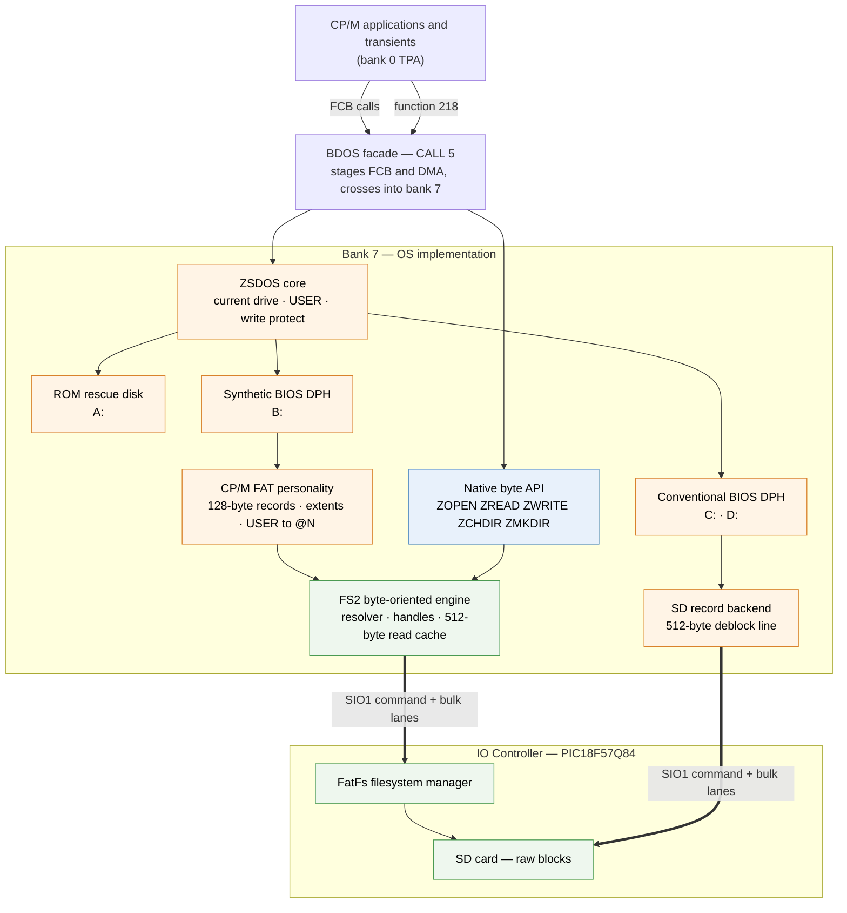

# Zephyr / ZSDOS Alteration Guide

> **Status:** Initial working version.
>
> This guide starts from the FAT-backed BDOS bring-up and the current Zephyr-80
> implementation. It is intended to become the normative maintenance guide for
> altering ZSDOS integration, BIOS behavior, BDOS interception, native Zephyr
> extensions, and related OS infrastructure.
>
> The current repository is authoritative for implementation details. This
> document records architectural rules and compatibility contracts that should
> remain stable even as addresses, symbols, and module layouts evolve.
>
> For historical context and the failures that led to many of these rules, see
> [FAT-BRINGUP-LESSONS-LEARNED.md](FAT-BRINGUP-LESSONS-LEARNED.md).

---

## Architecture at a glance

Two entry paths reach the same FAT files, and the whole of this guide is about
keeping them separate where they must be and shared where they can be.



Reading it:

- **ZSDOS stays on the CP/M path and owns CP/M state.** The FAT drive reaches
  it as an ordinary BIOS drive through a synthetic DPH, which is what lets
  drive selection, USER and write protection keep working unchanged
  (sections 3 and 6).
- **The two personalities converge at FS2, not above it.** The CP/M
  personality translates 128-byte records, extents and USER areas; the native
  API does not. Everything below that point is shared, which is why neither
  one's test coverage substitutes for the other's (section 38).
- **The facade is the only crossing.** Both entry paths go through it, and it
  is where caller pointers are staged — including the buffer aliasing that
  section 30 exists to warn about.
- **The controller owns the filesystem.** No FAT logic runs on the Z80. The
  conventional drives address raw blocks over the same transport that FS2 uses
  for file operations.

Drive letters are the current configuration, not an ABI: A: is the ROM rescue
disk, B: the FAT volume, C: and D: the conventional CP/M volumes. Section 36
covers changing that map.

---

## 1. Core design principle

Zephyr should extend ZSDOS **around its interfaces**, not gradually turn into a
private fork of ZSDOS.

The preferred layering is:

```text
application
    |
    v
CALL 5 / common facade
    |
    v
bank-7 dispatcher
    |
    +-- Zephyr-specific semantics
    |
    +-- ZSDOS_ENTRY
            |
            v
           BIOS
```

If a change can be implemented at the facade/dispatcher or BIOS boundary,
prefer that to modifying ZSDOS internals.

The FAT-backed drive is the reference example: Zephyr added a fundamentally
different filesystem while leaving ZSDOS authoritative for normal CP/M state.

---

## 2. State ownership must remain unambiguous

Do not create a second authoritative copy of CP/M state.

| State | Authority | Zephyr may do |
|---|---|---|
| Current drive | ZSDOS | mirror/cache it |
| USER | ZSDOS function 32 | mirror it |
| Software write protect | ZSDOS | mirror for intercepted mutations |
| DMA semantics | CP/M/ZSDOS facade contract | stage/copy as required |
| DPH/DPB/ALV | BIOS/ZSDOS-visible model | synthesize where a backend requires |
| FAT relative current directory | Zephyr FAT backend | own it and tag it with its USER |
| IOC/FS2 handles | Zephyr implementation | cache opportunistically |
| Media generation | FS2/IOC | mirror and invalidate local state |

A mirror must be disposable and reconstructible.

If losing a value would break correctness, it should not exist only as a
mirror.

---

## 3. Bank 7 is implementation space; common memory is ABI space

This is a Zephyr architectural rule.

> **Bank 7 is the normal implementation space for the OS. Common bank-0 memory
> exists for crossing and ABI requirements.**

New OS logic, tables, and persistent implementation state belong in bank 7 by
default.

Common memory is justified only for things that genuinely must remain visible
while application mapping is active, such as:

- CALL 5 / BDOS facade entry
- bank-transition helpers
- interrupt-entry infrastructure
- caller-visible returned objects
- staging buffers
- cross-mode stack/state

Free common memory is not by itself a reason to place implementation code
there.

The generated memory map and allocator ownership are authoritative. Historical
free ranges are not.

Reclaimable 512-byte arenas remain allocator-owned and must not silently become
permanent module storage.

---

## 4. The facade is an ABI boundary, not just a trampoline

The common facade exists because application-visible pointers and buffers
cannot simply be handed to arbitrary bank-7 implementation code.

Before adding a new BDOS extension or intercepted service, answer:

```text
What must cross between application mapping and bank 7?
What can remain entirely in bank 7?
Does the caller expect a pointer back?
Can that returned pointer legally refer to bank-7 storage?
```

Normally, application-visible pointers may not refer directly to private
bank-7 objects.

Reuse the existing facade staging and crossing mechanism. Do not invent a
second crossing framework for each new subsystem.

---

## 5. Intercept semantics, not bookkeeping

Zephyr should intercept calls where the **meaning of the operation changes**.

It should not duplicate ordinary ZSDOS bookkeeping merely because that is
possible.

The FAT personality is the model:

- FAT-backed OPEN/READ/SEARCH need alternate semantics, so they are intercepted.
- Current-drive selection remains ZSDOS function 14.
- USER remains ZSDOS function 32.
- ZSDOS software write protection remains authoritative.

When practical, let ZSDOS continue to maintain the state it already owns.

---

## 6. Synthetic BIOS personalities are preferred to parallel OS state

A backend does not need to be a real CP/M block filesystem to participate in
the CP/M disk model.

The FAT-backed drive provides enough synthetic BIOS behavior for ZSDOS to
select and log the drive normally:

```text
SELDSK  -> valid synthetic DPH
READ    -> harmless synthetic empty-disk view
WRITE   -> appropriate failure during read-only operation
DPB     -> synthetic CP/M geometry
ALV     -> synthetic capacity view
```

Real FAT file access occurs above this BIOS layer.

This has two important benefits:

1. ZSDOS keeps authoritative current-drive/login state.
2. If a FAT-dependent operation accidentally escapes interception, it fails
   against an empty synthetic drive instead of touching a previously selected
   conventional disk.

This pattern should be considered for future nontraditional storage
personalities.

`SELDSK` must validate the drive root, not a USER-relative current directory.
For the FAT D: personality, availability means that `/CPM/D` can be resolved
and a synthetic DPH can be returned. Replaying `/CPM/D/@N/<cwd>` during
`SELDSK` can make the whole drive disappear merely because a USER-specific
subdirectory was removed or because the probe omitted the USER component.
Path resolution belongs to the intercepted file/native operation after login.

---

## 7. FCBs are part of the ABI; IOC handles are not

Applications may copy FCBs.

Therefore an FCB must remain sufficient to reconstruct the file operation.

Do not hide an IOC/FS2 token inside an FCB or make correctness depend on a
specific controller handle surviving.

IOC handles may be cached for performance using an identity such as:

```text
drive
USER
current-directory generation
packed 8.3 filename
```

The handle is opportunistic.

If it disappears, becomes stale, or is invalidated by a namespace operation,
reopen the file and reconstruct the operation from authoritative FCB/path
state.

This rule allowed the FAT implementation to gain substantial performance from
cached FS2 handles without changing CP/M semantics.

Writable operations must acquire appropriate writable state separately. Never
silently reuse a stale or read-only cached token for mutation.

---

## 8. SEARCH FIRST / SEARCH NEXT form a rich compatibility contract

Do not reduce CP/M SEARCH to "find filenames matching a wildcard."

Legacy software may inspect the returned slot, DMA contents, USER, packed name,
extent fields, FCB mutations, continuation state and exhaustion result. The
Zephyr FAT personality follows the smaller contract established by the ZSDOS
characterization and accepted on hardware:

```text
match:
    DMA[0..127] = E5h
    DMA[0..31]  = one synthetic directory entry
    A           = 00h

exhaustion:
    A           = FFh
    DMA         = unspecified
```

The entry contains the source USER, a seven-bit-clean 8.3 name, EX/S1/S2/RC,
and zero allocation bytes. FAT HIDDEN/SYSTEM/ARCHIVE bits are not projected
into the CP/M name/type high bits.

Emit one entry per FAT file. For a large file, EX/S2/RC describe its terminal
logical extent; do not invent several physical extent entries. Multiple
synthetic entries made `DIR` print large filenames repeatedly. Function 35 is
the authority for the complete rounded-up record count.

The FAT bring-up also established that:

```text
FCB[0] = '?'
```

has a legitimate special SEARCH meaning under ZSDOS and must not be dismissed
as an invalid drive number. For function 17 it means current drive with a raw
all-USER search. The saved SEARCH context must carry that mode through function
18, enumerate USER 0 through 15, skip missing `@N` directories, and preserve
the source USER in each returned entry.

When changing SEARCH behavior, characterize actual ZSDOS observable behavior
rather than relying only on simplified CP/M documentation.

---

## 9. Existing utilities may not test what the command line appears to test

A shell command can hide important BDOS behavior.

For example, ZCPR2 TYPE can temporarily log into an explicitly named drive and
then perform file access using an FCB whose drive byte is zero.

Therefore:

```text
D> TYPE B:FILE
```

does not necessarily test the same path as an application holding an explicit
B: FCB while D: remains current.

VGMPLAYER exposed this distinction during FAT bring-up.

Before using a utility as a conformance test, determine which BDOS calls and
FCB values it actually generates.

Dedicated characterization tools are often more reliable than shell commands.

---

## 10. Explicit-drive FCB operations may contain hidden drive transitions

A ZSDOS call using an explicit B: FCB while D: is current may internally
behave like:

```text
remember D
select B
perform operation
restore D
return
```

Therefore an error reported during a BDOS READ on B: does not prove that the B:
data read itself failed.

The later restoration of D: may have failed.

When debugging drive-selection problems, trace actual SELDSK transitions rather
than inferring the failing physical operation from the high-level BDOS call
that reports the error.

---

## 11. High-level filesystem errors may originate below the filesystem

The FAT bring-up exposed an IOC receive race that appeared at first to be a
filesystem or drive-state failure.

The important transport rule is:

```text
waiting for first RX byte:
    interrupts enabled

first RX-ready indication:
    DI

marker recognition
reply reception
bulk phase

    EI
```

The MCU is the clock master. Once the first byte of a reply arrives, the timing
deadline has begun.

Masking interrupts only after marker recognition is too late if an interrupt
can allow the SIO FIFO to overflow.

A transport failure may surface as a ZSDOS "No Drive" or filesystem error.
Do not assume that the layer reporting the failure is the layer that caused it.

---

## 12. BIOS interrupt ownership is an architectural boundary

The current Zephyr design makes the BIOS/core the owner of the IM2 vector page.

Programs register callbacks through Zephyr mechanisms rather than taking
ownership of the I register or rewriting the vector table.

When adding interrupt sources:

- preserve BIOS/core ownership of the interrupt architecture;
- let drivers own device-specific handling policy, not the global vector model;
- account for devices such as the V9958 whose interrupt behavior does not map
  naturally onto the same vectored model as CTC/SIO sources.

Any alteration to interrupt behavior should be reviewed as an OS architecture
change, not merely a device-driver detail.

---

## 13. Native extensions bypass CP/M semantics, not necessarily CALL 5

BDOS function 218 is the current native-filesystem precedent.

A Zephyr-native program may still enter through CALL 5, but operations such as:

```text
ZOPEN
ZCLOSE
ZREAD
ZSEEK
ZTELL
ZSTAT
ZOPENDIR
ZREADDIR
ZCHDIR
```

are not CP/M FCB operations.

This allows the same FAT files to have two personalities:

```text
Legacy CP/M view
    FCB
    USER
    128-byte records
    synthetic extents

Zephyr native view
    paths
    byte offsets
    larger transfers
    directories
```

Do not contaminate the native API with CP/M record semantics merely because
CALL 5 is currently the syscall gateway.

The FS2 resolver is neutral. The bank-7 native operation decides whether to
prepend the FAT personality root, the selected USER namespace and the saved
relative CWD. The accepted order is:

```text
/CPM/D/@N/<relative-CWD>/<component>
```

USER 0 omits `@0`. USER must precede the relative CWD.

Function 218 has two status representations that must agree: the status byte
copied into the descriptor and A returned through CALL 5. Common crossing code
may inspect the operation to decide whether a READ payload needs copying, but
must preserve the bank-7 return value while doing so.

A future OS such as GameOS may expose the same underlying native services
through another entry mechanism without changing FS2 or FatFs.

---

## 14. Resource services belong above the native filesystem API

The resource manager should not become another filesystem.

The intended layering is:

```text
RESOURCE_OPEN / READ / SEEK
        |
        v
ZOPEN / ZREAD / ZSEEK
        |
        v
FS2
        |
        v
FatFs
```

The resource layer may add:

- caching
- decompression
- prefetching
- streaming
- symbolic asset lookup
- eviction policy

It should not duplicate path resolution or file allocation.

---

## 15. Optimize implementation work below the compatibility boundary first

The FAT performance work provides a useful pattern.

First, 512-byte deblocking converted four 128-byte CP/M reads into one expensive
filesystem operation and produced a substantial improvement.

Then an opportunistic cached FS2 read handle changed repeated lifecycle work
from approximately:

```text
OPEN
READ
CLOSE
OPEN
READ
CLOSE
...
```

to:

```text
OPEN
READ
READ
READ
...
```

This brought FAT-backed CP/M reads to practical parity with the optimized
native CP/M volume.

The lesson is broader than FAT:

> Remove repeated implementation work below the compatibility boundary before
> changing the compatibility boundary itself.

Only after measuring remaining overhead should more invasive changes, such as
a cheaper facade crossing, be considered.

---

## 16. Correctness must not depend on caches

Deblocking slots, cached handles, and similar accelerators are optimizations.

If a cache lease cannot be obtained, the operation must still work through a
slower path.

If a cached read handle becomes stale or disappears, safe read operations may
reconstruct state and reopen.

A cache failure should reduce performance, not correctness.

---

## 17. Writes have a different recovery model from reads

Reads can generally be retried after reconstructing state.

Writes cannot always be retried safely.

A failed write transaction may be:

```text
definitely not committed
definitely committed
completion unknown
```

The third state must not be silently converted into "retry."

Writable FS2/native/BDOS work must preserve this distinction through the API
and invalidate any state whose commit status is no longer known.

This rule should be expanded as writable FAT milestones mature.

---

## 18. Similar metadata bits are not automatically equivalent

FAT HIDDEN/SYSTEM/ARCHIVE were initially projected into CP/M attribute bits.

That proved incorrect.

The semantics do not line up cleanly and real CP/M software noticed.

Current policy:

- do not project FAT HIDDEN/SYSTEM/ARCHIVE into synthetic CP/M attributes;
- keep FAT metadata internal to the FAT filesystem;
- treat ZSDOS software write protection as a separate OS-level concept.

General rule:

> Similar-looking metadata fields are not equivalent unless their behavior is
> equivalent.

---

## 19. Characterization utilities are executable specifications

Keep tools such as `BDOSCHAR.COM`, transport stress programs, filesystem
diagnostics, and application-level regression tests in the tree.

They are not disposable bring-up artifacts.

Future changes to:

- ZSDOS integration
- banking
- the facade
- BIOS behavior
- filesystem personalities
- caching
- transport
- interrupt handling

can silently violate old assumptions.

The tools provide executable documentation of those contracts.

Different applications also make useful compatibility probes:

| Probe | What it exposed |
|---|---|
| DIR | synthetic SEARCH/extent behavior |
| TYPE | ordinary sequential access |
| CRC | raw SEARCH semantics and `FCB[0]='?'` |
| VGMPLAYER | large streaming, explicit-drive FCBs, interrupt timing |
| ZCD | per-drive hierarchical current-directory state |
| conventional-drive regressions | accidental damage outside FAT personality |

---

## 20. Current implementation landmarks

These names describe the current tree and are useful starting points when
altering the OS. They are implementation landmarks, not permanent ABI.

```text
Code/HOST/CPM2.2/src/cbios_facade.asm
    common/application crossing
    fac_bdos
    Zephyr extension routing

Code/HOST/CPM2.2/src/cbios_native_gate.asm
    function-218 descriptor crossing
    application/native read-data staging
    preservation of native status across the crossing

Code/HOST/CPM2.2/src/cbios_fat_layout.asm
    bank-7 FAT personality
    fat_bdos_dispatch
    fat_bdos_post
    fat_bdos_or_zsdos
    fat_native_entry

ZSDOS_ORG   = 2000h
ZSDOS_ENTRY = 2006h
BIOS7_BASE  = 3000h

BDOS function 218
    versioned native filesystem descriptor
    ZOPEN/ZCLOSE/ZREAD/ZSEEK/...

Code/MCU/IOController/src/fs2.c
    IOC native filesystem service

Code/HOST/Utilities/src/zcd.asm
    native hierarchy utility
    ZCPR direct-return and explicit DU: target precedent

FS2
    additive to the existing /SHARED service

Code/HOST/CPM2.2/src/cbios_irq.asm
    BIOS-owned IM2 infrastructure
```

Before modifying code, re-check the current generated maps and source. Do not
assume that addresses or exact symbol layouts recorded here remain fixed.

---

## 21. Practical alteration workflow

When adding or changing OS behavior:

1. **Identify the authority.**  
   Decide which existing component owns the state or semantic contract.

2. **Choose the lowest safe extension boundary.**  
   Prefer BIOS/facade/dispatcher/native service boundaries over ZSDOS internals.

3. **Classify memory placement.**  
   Default to bank 7. Justify any new common-memory object.

4. **Characterize observable legacy behavior.**  
   Especially for BDOS, FCB, SEARCH, drive-selection, and USER semantics.

5. **Keep implementation state reconstructible.**  
   Cached handles and caches must not become hidden ABI.

6. **Preserve conventional-drive regressions.**  
   New personalities must not change A:/B:/C: behavior accidentally.

7. **Separate correctness from optimization.**  
   Make the simple path correct first, then add deblocking/caching/handle reuse.

8. **Measure before altering transport or facade architecture.**

9. **Document any reason to patch ZSDOS itself.**  
   If a change cannot be achieved at the existing boundaries, record:
   - what cannot be achieved;
   - why;
   - the minimum ZSDOS change required;
   - compatibility consequences.

10. **Exercise the complete crossing.**  
    A direct bank-7 unit test does not prove that the facade stages pointers,
    copies descriptors and preserves returned status correctly.

11. **Add the resulting lesson to this guide or the lessons-learned document.**

---

## 22. Guiding principle

The strongest lesson from the FAT-backed drive work is:

> **Keep ZSDOS authoritative for CP/M semantics, and insert Zephyr-specific
> implementations underneath or beside those semantics wherever possible.**

That principle explains the successful use of:

- synthetic BIOS drives
- bank-7 dispatch
- facade staging
- native function 218
- disposable FS2 handles
- separate native and CP/M filesystem personalities
- characterization rather than invasive ZSDOS patching

The goal of future alterations should be to preserve that separation unless a
measured, documented requirement proves it insufficient.

---

## 23. Planned future additions

This first version should be expanded as other development sessions contribute
their own findings.

Useful additions include:

- detailed write-completion and unknown-commit rules
- MAKE/CLOSE/write-random semantics
- warm boot and reset behavior
- exact USER and write-protect mirroring rules
- driver-slot / core / state ownership rules
- how to add a new storage personality
- how to add a new BDOS-native extension
- interrupt-registration rules
- memory-map change procedure
- regression matrices for BIOS, BDOS, and native APIs

Sections 30-40 cover several of these from the writable and performance work:
adding an intercepted BDOS function (31), adding a native extension (33),
memory-map and drive-map changes (36), and what each test boundary proves
(38). Still missing, and worth writing when someone next has cause to learn
them:

- adding a new storage personality end to end
- interrupt-registration rules
- behaviour during media removal or a genuinely full volume, which needs
  physical setup rather than an injected status

---

## 24. FAT BDOS dispatch checklist

An alteration to the FAT personality should begin by classifying the FCB drive
byte and BDOS function together.

The relevant drive forms are:

```text
FCB[0] = 0       current drive
FCB[0] = 1..16   explicit A: through P:
FCB[0] = 3Fh     special raw SEARCH form, function 17 only
```

For ordinary FCB calls, intercept only when the effective drive is the FAT
drive. Explicit conventional-drive FCB calls must continue into ZSDOS even
while D: is current. SEARCH NEXT is routed from the saved SEARCH context,
because it has no new FCB drive selection to inspect.

The current-drive and USER mirrors are maintained after successful ZSDOS calls:

- function 14 updates the current-drive mirror;
- function 32 setter updates the USER mirror;
- function 32 query does not replace the mirror;
- disk/reset operations invalidate transient search and cached-handle state as
  required.

Do not call ZSDOS function 32 on every FAT operation. ZSDOS is still the
authority; the dispatcher maintains a coherent mirror of changes that already
pass through it.

When adding an intercepted function, verify all three routes:

1. current FAT drive;
2. explicit FAT drive while another drive is current;
3. explicit conventional drive while FAT is current.

The third route is easy to break because ZSDOS may temporarily select the
conventional drive and then restore the synthetic FAT drive before returning.

---

## 25. USER and relative-directory projection rules

The CP/M compatibility view is:

```text
USER 0      /CPM/D
USER 1      /CPM/D/@1
...
USER 15     /CPM/D/@15
```

A saved relative current directory follows that USER component. A directory
selected for USER 8 is not applied to USER 14. Store the owning USER with the
relative-CWD state and treat a different USER as being at its namespace root.

For an explicit utility target such as `D8:TESTDIR`, temporarily select USER 8
through the existing BDOS function-32 path, perform the native operation and
restore the caller's USER. This keeps the ZSDOS authority and bank-7 mirror in
sync.

Packed USER components are exactly 11 bytes. One- and two-digit forms require
different padding:

```text
@8          2 characters + 9 spaces
@15         3 characters + 8 spaces
```

Test USER 9, 10 and 15 and inspect the byte immediately after the component.
The original `@10` formatter wrote twelve bytes and corrupted the adjacent CWD
count.

An empty native CHDIR component is the recovery operation that selects the
target USER root. It must run before replaying the old CWD so it still works if
the old directory was removed externally.

Parent-directory syntax requires a separate, explicit containment decision.
A one-level `ZCD ..` test returning to the expected root does not prove that
arbitrary-depth `..` traversal is normalized or cannot escape the projected
USER root.

---

## 26. Function-218 crossing checklist

Keep the native filesystem implementation in bank 7 and keep the common gate
mechanical. The established crossing sequence is:

```text
application descriptor
    -> copy fixed descriptor into common staging
    -> enter bank 7 through the existing crossing helper
    -> execute fat_native_entry
    -> for READ, copy the validated returned byte count to the caller buffer
    -> copy the descriptor back
    -> return the original bank-7 A status
```

When altering this path:

- preserve AF before using A to dispatch on the operation;
- make descriptor status and returned A agree;
- reject or bypass zero-length `LDIR` operations;
- bound application payloads to the existing common staging capacity;
- keep caller pointers out of bank-7 code unless they refer to common memory;
- reuse `xing_os_call_ix` rather than adding another common stub;
- check the fixed common-region limit after every instruction change.

A native worker test alone will not catch a gate that returns the operation
number instead of the worker status. Include an assembled test at the common
copy/return boundary.

The current native gate fills its assigned common region. Any further growth
requires a deliberate memory-layout decision, not use of a nearby byte that
happens to look free.

---

## 27. ZCPR utility rules for native extensions

ZCPR2 invokes a transient with `CALL 0100h`. A utility that replaces SP with a
private stack must save the entry SP and restore it before `RET`:

```text
save entry SP
install private SP
...
restore entry SP
RET
```

Returning with the private stack pops program bytes as an address. Jumping to
0000h avoids that corruption but forces a warm boot and bypasses ZCPR's normal
direct-return cleanup.

Use the command tail at 0080h to distinguish a bare command. Do not assume the
default FCB contains a reliable no-argument sentinel.

For `DU:` arguments, ZCPR leaves the drive and packed 8.3 name in the default
FCB, but its parsed USER remains private to ZCPR. A utility that accepts
`D8:TESTDIR` must recover USER 8 from the untouched command tail, validate the
supported 0..15 range, apply it temporarily and restore the original USER.

Keep command location independent from operation target. A ROM-resident or
path-qualified utility must support forms such as:

```text
A0:ZCD D8:TESTDIR
B0:ZCD D8:
```

and return to the caller's original drive/USER.

---

## 28. Packed fields and persistent-state adjacency

Assembly layouts make adjacent-state corruption easy to misdiagnose. For every
packed field or counted array, test:

- empty value;
- maximum one-character-width value;
- first value requiring another character;
- maximum accepted value;
- maximum component depth;
- sentinel byte immediately after the storage.

Do not rely only on a functional success result. A routine may return success
while overwriting the state used by the next operation.

Persistent state should be declared in deliberate fixed storage and included
in the generated map. Do not move it into the reclaimable `6600h–7FFFh` cache
arena or consume apparently free common bytes.

---

## 29. Minimum FAT regression matrix

After changing FAT dispatch, SEARCH, native hierarchy, drive selection or USER
projection, run at least:

```text
D: DIR / TYPE / CRC on a small file
D: CRC and VGMPlayer on a large file
B: VGMPlayer D8:large-file
D: VGMPlayer B8:large-file
ZCD into a subdirectory, then DIR and CRC
return to the expected USER root
USER 1 DIR/CRC, then USER 0 DIR
B: DIR / TYPE / CRC on a conventional CP/M file
```

Also exercise a native utility from a different drive, for example:

```text
B0:ZCD D8:TESTDIR
B0:ZCD D8:
```

This matrix checks distinct contracts: small and large SEARCH, sequential
extent transitions, both directions of explicit-drive access, native crossing,
USER isolation and regression of the conventional backend.

The read-only implementation passed this matrix on hardware on 2026-09-22.
Record future acceptance results beside the implementation milestone rather
than replacing the test procedure with a general statement that the drive
"works."

---

## 30. The facade's staging buffers alias each other

This is the single most dangerous implicit contract in the crossing layer.

The common staging area is one buffer wearing several names:

```text
FAC_BULK_BUF   the IOC bulk staging buffer
FAC_DMA_BUF    = FAC_BULK_BUF
FAC_TIME_BUF   = FAC_BULK_BUF
FAC_CONBUF     = FAC_BULK_BUF
GATE_TX_BUF    = FAC_BULK_BUF
MOVE_XBUF      = FAC_BULK_BUF
```

When an application's DMA is hidden under bank 7 — the ordinary case, since
the TPA is hidden — the facade stages the caller's record into `FAC_DMA_BUF`,
which *is* the bulk buffer. A bank-7 worker that sends anything through the
bulk buffer before it has consumed the caller's staged data destroys that data
and then transmits the wreckage.

The rule for any new intercepted function that both reads caller data and
issues controller traffic:

> Consume or relocate the staged caller data **before** the first transfer
> that passes through the common bulk buffer.

Relocating means copying to bank-7 scratch, which is cheap and unambiguous.

Two properties make this fail quietly:

- A worker that copies the caller's DMA *to* the bulk buffer as its only use
  of it is safe, because that copy becomes a copy onto itself. Most write
  paths look like this and are unaffected, so the hazard appears to not exist.
- A bank-7 unit test that supplies its own scratch DMA at a distinct address
  never reproduces the aliasing at all.

Any test for such a function must include a case with the caller's buffer
pointing at `FAC_BULK_BUF`. That is not an edge case; it is the normal path.

---

## 31. Adding an intercepted BDOS function is four edits, not one

Intercepting a function requires agreement between the facade, the dispatcher
and the post-call mirror. Missing any one of them produces a failure that
looks like it belongs somewhere else.

```text
1. cbios_facade.asm flags table   F_FCB / F_SFCB / F_DMA_IN / F_DMA_OUT
2. fat_bdos_dispatch              route, and return with carry set
3. fat_bdos_post                  mirror maintenance, if the call changes
                                  drive, USER, the read-only vector or
                                  transient context
4. the regression harness         all three drive routes from section 24
```

The flags table is the one most easily forgotten and the least obvious when
wrong: it is what decides whether the caller's FCB and DMA are staged in, out,
or both. A write function declared without `F_DMA_IN` receives whatever the
staging buffer last held rather than the caller's record.

The dispatcher's return convention is carry-set for "handled, `A` is the BDOS
result" and carry-clear for "continue into ZSDOS". A routine that returns the
right value with the wrong carry silently runs ZSDOS as well.

Functions that must stay refused should be refused explicitly and commented
with the reason, not left to fall through. Function 30 (set attributes) is the
example: FAT attribute projection was deliberately removed, so there is
nothing for it to set, and returning success would be a lie the caller cannot
detect.

---

## 32. Re-establish flags before branching on a status

Bank-7 workers commonly classify a returned status before deciding what to do
with it. The classification destroys the flags the decision needs:

```text
    call some_operation          ; A = status, flags from it
    cp   #SOME_SPECIFIC_STATUS   ; flags now describe the comparison
    jr   nz,generic_path
    ...
generic_path:
    jp   nz,return_the_error     ; wrong: tests the CP, not the status
```

On success `A` is zero, the comparison sets NZ, and the success path is
skipped. Errors still behave because they are also NZ, and the specific status
still behaves because it is Z, so only the ordinary case is wrong — which is
the case least likely to be exercised by an error-injection test.

Write `or a` before the branch. More usefully for review: **the sibling
routines in this codebase already do.** When several workers share the shape
"call, classify, branch" and one of them lacks the re-test, that asymmetry is
the defect. Compare against the siblings before reasoning about the logic.

---

## 33. Native operations: spend the descriptor, not the gate

The function-218 descriptor is a fixed 32 bytes. The name field occupies
`12h`-`1Ch`, leaving three bytes after it, and the gate that copies it is in a
full common region (section 26). Any design that needs the gate to stage more
data is expensive; any design that fits the existing descriptor is free.

Two idioms avoid touching the gate:

**Reuse fields the operation does not need.** A rename carries no position,
length, buffer or result, so its second name fits at `06h` without changing
the descriptor size or version. Document the alias next to the offset.

**Answer large results one element at a time.** Reading the current directory
back could need sixteen components. Instead of staging an array, the operation
takes an index and returns the depth with every answer:

```text
in:   FLAGS  = component index
out:  RESULT = total depth
      NAME   = that component, when the index names one
```

The caller loops. An index past the end is success with the count, not an
error — that is how the loop terminates. This needs no staging, no gate
change, and no new common memory.

When adding an operation, also state whether it touches the controller. An
operation that answers purely from bank-7 state should be asserted to issue
zero controller traffic; that assertion is what stops a later change from
quietly turning a memory read into a round trip.

---

## 34. Leasing from the reclaimable pool

The pool is thirteen 512-byte lines with no permanent owner. Its contract is
that a lease may be refused, and the discipline that follows from that is
easy to get subtly wrong.

**Initialise the owner table explicitly.** `.ds` reserves space but leaves
whatever fill the image build produces. An owner table of `FFh` reads as
"every line already owned", every lease is refused, and the feature is
silently disabled — with no symptom, because the fallback path is correct.
Use `.db 0,0,...`.

**Ask once.** A refusal is permanent for the session. Re-asking on every
operation costs more than the lease saves.

**Distinguish refusal from failure.** These are not the same event and must
not share a path:

```text
no lease available      -> use the slower proven path (the pool contract)
lease held, work failed -> propagate the error
```

Falling back to the alternative path after a *failed* operation silently
retries it through different code, which hides real faults and doubles the
cost of every hard error.

**A handle is a lease against someone else's pool.** Caching an IOC handle
holds one of the controller's two file slots. That is permitted — handles are
opportunistic and the FCB is authoritative — but it obliges the holder to hand
the slot back at every point another caller might need it, to reopen once when
the controller retires the token underneath it, and to clear its own tag
before attempting the close rather than after.

---

## 35. Cache invalidation is an enumeration, not an instinct

Adding any cache below the compatibility boundary creates an obligation to
list every operation that can invalidate it, and to keep that list next to the
cache. For the FAT read cache the list is:

```text
FCB writes, MAKE, DELETE, RENAME, random-write zero fill
native write, truncate, delete, rename, mkdir, rmdir
writable native OPEN (CREATE_ALWAYS truncates)
CHDIR, USER change, drive change, disk reset, context reset
media generation change
```

Two rules make the list maintainable:

- **Invalidate generously.** Each hook is one call. Reasoning about which file
  a mutation touched, in order to keep a cache line alive, is not worth the
  risk.
- **Separate "drop the memory" from "release the resource".** A line is only
  memory and can be dropped anywhere. A cached handle is a controller slot and
  must be closed. The refill path needs the first without the second, or the
  cache can never hit; the mutation paths need both.

The regression for this is a write-then-read of the same file through the
compatibility path, asserting the *new* data comes back. Removing any hook
must fail it.

---

## 36. Changing the drive-letter map

Drive letters are encoded in more places than a single constant. The procedure:

```text
1. cbios_defs.inc      SD_STORAGE_DRIVE, SD_STORAGE_DRIVE2,
                       SD_STORAGE_DRIVE_LIMIT, FAT_BIOS_DRIVE
2. the dispatcher      derive the unit from the constant
                       (sub #SD_STORAGE_DRIVE, never a hardcoded dec)
3. the resolver root    the FAT root path component carries the letter
4. utilities           the ONE-based FCB drive, the read-only vector bit,
                       and the function 37 drive vector bit
5. tests               drive numbers, vector bits, resolver expectations
6. user-visible text   help strings and error messages naming the letter
```

Two traps:

- Range checks that key off the constants follow automatically; arithmetic
  that hardcodes the offset does not. Derive, do not assume.
- The FAT root path component matching the drive letter is a **convention on
  the card**, not something the code requires. Changing the letter without
  renaming the directory leaves the drive apparently empty; changing the
  directory without the letter leaves a name that reads as a mistake later.
  Decide deliberately and say which you chose.

Utilities carry the drive letter compiled in, so a letter change is a coupled
release: ROM and every affected `.COM` together.

---

## 37. Protocol additions move the firmware level

A controller command range added to `ioc_frame.h`, `dispatch.c` and
`external_sync.c` is **four** edits: the level moves with it, in both
`ioc_frame.h` and the tools' `ioc_levels.inc` mirror.

The reason is specific rather than tidy-minded. A controller that does not
admit a command *drops the frame* rather than refusing it, which presents to
the host as a hang. When the level does not move, a firmware that predates the
command is indistinguishable from one that has it, and "is the controller
running what I think it is" cannot be answered from the machine — during
exactly the failure where that is the first question.

The complementary rule is to **negotiate before using**. The capability query
and its flag bits exist; a host that issues a command without checking the
advertised capability cannot distinguish "this controller lacks the feature"
from "this controller is not answering". A tool that queries capabilities
first can say which in one line instead of hanging.

---

## 38. Know what each test boundary actually proves

The three levels are not substitutes, and the gaps between them are where the
expensive defects live.

```text
bank-7 harness   the routine's logic, against a modelled controller.
                 Does NOT prove the facade stages pointers, and does not
                 reproduce buffer aliasing (section 30).
crossing test    the gate copies the descriptor, stages payloads and
                 returns the worker's status rather than the operation.
hardware         everything the models got wrong.
```

Three obligations follow:

- **Cover every personality separately.** Applications that reach files
  through FCB calls prove nothing about the native API over the same files,
  and vice versa, even though they share a transport, resolver and handle
  pool. An operation with no consumer has no coverage.
- **Mutation-test new assertions.** Delete the behaviour and confirm the test
  notices. A model that defaults to the expected value cannot test the
  guarantee: for "this region reads back as zeros", the model must fill the
  region with something else, or the assertion passes with the implementation
  removed.
- **Run compatibility suites on a conventional drive too.** A suite written in
  plain BDOS calls runs on any drive, and turns "does this work" into "does
  this differ". A failure on one drive and a pass on the other localises the
  fault immediately; an identical failure on both means the expectation is
  wrong, not the code.

---

## 39. Optimise round trips first, and know the ceiling

Section 15 says to optimise below the compatibility boundary. The measurement
that matters when doing so is **controller transactions per unit of data**,
not wall-clock time, because it says where the cost is rather than that there
is one.

The FAT read path measured, for a 64 KiB sequential read:

```text
per 512-byte line, originally   6 mailbox + 1 bulk
                                ROOT, PUSH, PUSH, OPEN, READ, CLOSE, transfer
with a cached open handle       1.03 mailbox + 1 bulk
```

One of the original seven moved data. The rest re-resolved the path and
reopened the file for every line, because the compatibility layer opens and
closes per record by design.

The order that follows:

1. **Eliminate repeated setup** — a cached handle removed five of six.
2. **Deblock** — serve several CP/M records from one transfer.
3. **Reduce host work** — buffer copies and padding in the delivery path.
4. **Block size, last.** The controller's transfer ceiling is fixed, so a
   larger line does not reduce the number of transfers; it only amortises
   setup that step 1 has already removed.

And know where the floor is. CP/M's 128-byte record means four facade
crossings per 512 bytes, each staging an FCB in, the DMA out and the FCB back.
That ceiling is shared by every CP/M drive on this machine, conventional or
synthetic — confirmed by both reading the same file in the same time. A
byte-oriented native reader is faster on the same file than any FCB-based one
can be, and that is a property of the interface, not a defect to chase.

---

## 40. Utility-side conventions for OS extensions

Tools are part of the contract: a tool that misreports makes a working OS look
broken.

**Directory functions return 0-3 on success.** Open, close, make, delete,
rename and search return a directory code, not zero. A plain `or a` rejects a
perfectly good result; test `cp #4` and treat carry as success.

**`cp`, `and` and `sub` leave their operand in `A`.** A helper that ends
`ret z` after a comparison returns the compared value, not a success code.
This was written three times in one session across different utilities, and
each time it surfaced as a passing operation reported as a failure.

**The CCP cannot express `..`.** The CP/M name parser stops the name field at
the first `.`, so `CD ..` and a bare `CD` are identical in FCB1. Only the
untouched command tail distinguishes them. Any utility whose argument syntax
extends beyond 8.3 must parse the tail, as the existing DU-prefix handling
already does.

**Destructive operations need the self-reference check.** `MAKE` truncates, so
copying a file onto itself empties it and then reads back what it emptied,
destroying the file and reporting success. Check both the explicit form and
the implied one where a destination names only a drive that happens to be the
source's. For a move, delete last, after a successful close, so any earlier
failure leaves the original in place.

**Release shared controller resources.** There is one directory slot, shared
between the native enumeration API and CP/M `SEARCH`. A utility that opens a
directory and exits without releasing it breaks the next `DIR`. Where no close
operation exists, forcing a context reset is an acceptable workaround — but
record it as a workaround, with the operation it stands in for.
